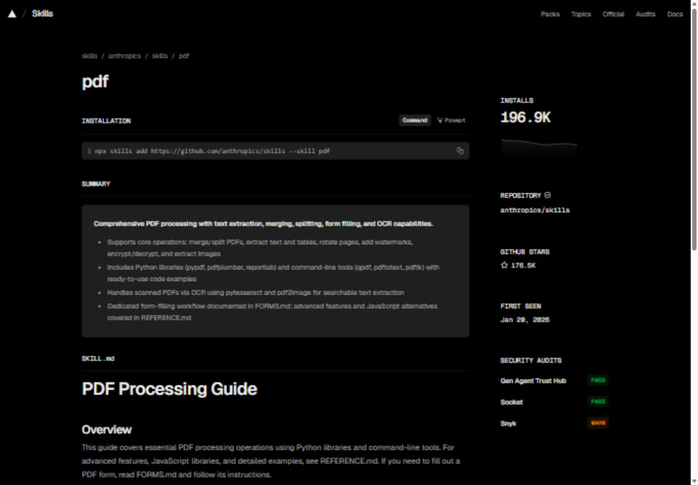
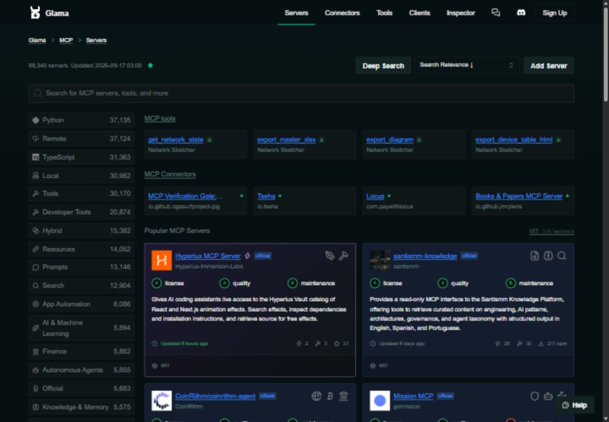
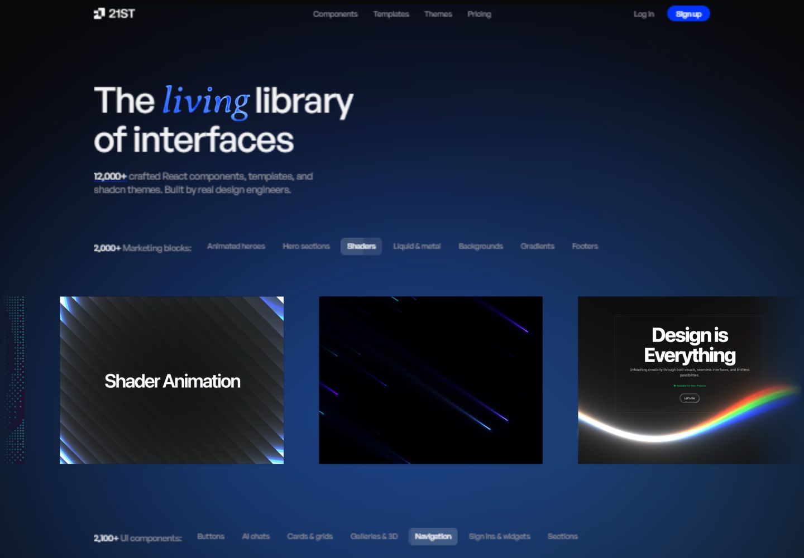
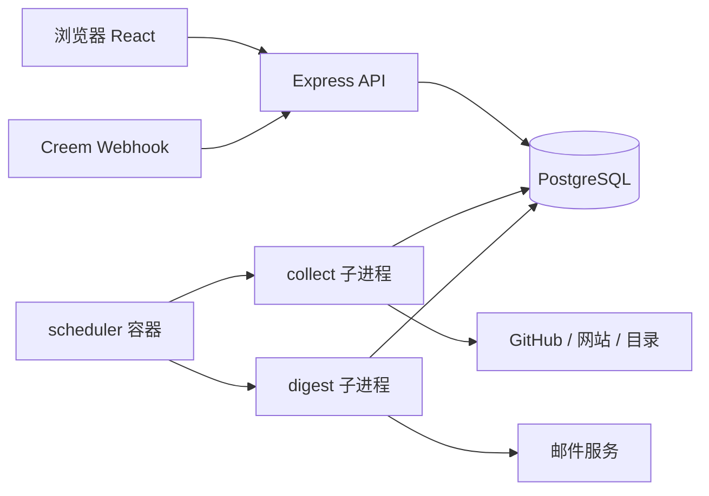
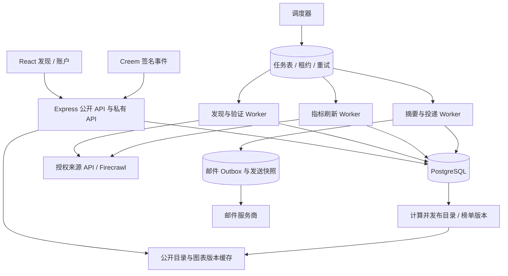

# Trend Top 竞品对比与产品发展报告

日期：2026-09-17 · 对比基线：`main@bdb2144` · 报告语言：中文

> **建议定位：跨类型开源资源发现与持续情报。** 用户来这里发现可用的资源、判断是否适合、比较替代方案，并持续获知重要变化。六类资源是内容覆盖范围；可靠的发现、比较与跟踪才是产品价值。不要把六个竞品的所有功能拼成一个网站。

## 1. 结论与决策建议

Trend Top 可以同时覆盖 Skills、Plugins、Agents、Components、Websites、Repositories，但要做到“同一种发现体验，不同类型有不同证据和行动”。不应让所有类型都成为换了标题的 GitHub Star 榜。

推荐优先做五件事：

1. **把资源身份、分类和指标做可信。** 整仓库、某个 Skill、MCP Server、在线网站可以属于同一产品，但不是同一个资源。安装量、仓库 Star、下载量不能混为使用量。
2. **让详情页帮助选择和开始使用。** 用户需要知道“解决什么问题、怎么开始、有哪些要求、为什么推荐”，而不只是三张数字卡和外链。
3. **让 Pro 卖持续筛选与变化情报。** 免费目录帮助发现；Pro 帮用户每天少看几十个页面，只收到值得处理的变化。每日邮件只是交付渠道。
4. **先治理性能和采集可靠性，再扩张来源。** Firecrawl 能补充网站信息，不能自动解决查询慢、邮件延迟、榜单数据缺失。
5. **保留我们的视觉风格。** 黑白蓝、方框按钮、清楚的排版和紧凑榜单可以成为区别；借鉴竞品的信息组织和行动设计，不需要复制橙色、深绿、吉祥物或大面积渐变。

**暂不建议发展为 MCP 托管平台、AI 生成工具、组件交易市场或通用 SaaS 导航站。** 这些方向有各自的运行成本、授权要求和服务承诺，会分散当前产品。

### 1.1 哪些是本次已完成，哪些仍是建议

| 类别 | 状态 | 内容 |
| --- | --- | --- |
| 本次代码修复 | 已提交、已推送 | `bdb2144`，用途迁移与分页前筛选、真实 Skill 验证、采集失败保留旧数据、资源级计数归属、关注列表基线、Free/Pro 与邮件状态标签、移除不可操作的登录配置状态 |
| 本次验证 | 已执行 | 完整测试与生产构建通过；补充的分类、采集、资源身份、关注列表针对性回归通过。修复详情见下方文档 |
| 竞品研究 | 已执行 | 阅读公开页面、官方说明与 API 文档；保存并检查六张公开页面截图 |
| 本报告路线图 | 尚未实现 | 产品资源分层、详情模板深化、邮件指标统一、任务解耦、版本缓存、更多 Pro 情报等 |
| 线上验收 | 未执行 | 没有访问我们的网站进行页面检查，没有测线上接口耗时，没有部署，没有创建竞品付费订阅或执行付费 Firecrawl 采集 |

已完成修复说明：[分类、采集与账户展示修复](../CATALOG_COLLECTION_FIXES_2026-09-17.md)。既有产品适配审查：[PRODUCT_FIT_REVIEW](PRODUCT_FIT_REVIEW_2026-09-17.md)。

## 2. 研究边界与判断方式

报告中采用三种表述：

- **已核实：** 竞品公开页面、官方文档，或者当前代码中的具体行为。
- **判断：** 基于产品目标、用户任务和可见信息作出的评价；不代表有竞品内部经营数据。
- **建议：** 我们可以实施的下一步，不代表已经上线。

用户写的 `skill.sh` 当前是停放域名；本报告按实际相关产品 **skills.sh** 研究。竞品数量、排序、价格会变化，页面上的数量也不代表去重后的优质资源数量。不用这些数字证明谁更好。

视觉证据包括 skills.sh 首页、Skill 详情、Glama 目录、Smithery 首页和 21st.dev 首页。桌面截图统一为 1440 × 1000；另保留一张 skills.sh 的窄屏首屏。这里只评价已捕获的公开状态，未完整测试鼠标悬浮、登录、付款和手机端交互。Trend Top 的判断来自代码和你提供的截图，不是此次线上 UI 验收。

## 3. 竞品地图：各自解决什么问题

| 产品 | 主要用户任务 | 核心对象 | 最值得我们学习 | 不宜直接照搬 |
| --- | --- | --- | --- | --- |
| skills.sh | 找到并安装适合 Agent 的 Skill | 仓库中的具体 Skill、Skill Pack | 安装入口、资源身份、内容说明、不同指标分开 | 用其安装遥测口径替代我们的 Star 增量；照搬超大目录数量 |
| Glama | 选择、理解 MCP Server / Connector | Server 源码与可连接的远程端点 | 能力、运行方式、维护与许可证分维度展示 | 将平台评分当安全保证；未经许可整合其数据 |
| Smithery | 发现并连接 Agent 工具 | MCP、Skill、连接与凭据 | 从发现到使用的行动链路 | OAuth 托管、工具运行和凭据基础设施全部自建 |
| Trendshift | 发现正在变化的开源项目 | 仓库及历史趋势 | 时间窗口、历史、趋势解释 | 将其 API 订阅与我们的邮件 Pro 当同一种套餐 |
| 21st.dev | 找到可以使用的界面资源 | 组件、主题、模板 | 预览优先、按实际效果选择 | 把所有资源视为免费开源；直接进入交易、AI 生成业务 |
| 官方 MCP Registry | 获取标准化发布元数据 | 版本化 MCP Server 记录 | 身份、包、运行方式的结构化来源 | 将“官方目录收录”理解成“厂商官方”或“安全认证” |
| PulseMCP | 发现 MCP 资源并理解生态变化 | Servers、Clients、用例、编辑内容 | 解释变化、编辑取舍、来源透明 | 只扩大目录数量；复制新闻全文或误用其品牌 |

这是能力分布表，不是对所有功能和价格的穷尽清单。各产品的事实依据在对应分析中列出。

## 4. skills.sh：让 Skill 从目录条目变成可安装资源

### 4.1 已核实的做法

skills.sh 的列表区分 All Time、Trending、Hot；其 FAQ 说明榜单与 Skills CLI 的匿名聚合安装遥测有关。具体 Skill 详情提供安装命令、说明内容、仓库信息和审计结果。我们查看的 PDF Skill 页面同时出现不同审计方的 Pass / Warn，说明结果不是一个笼统“安全”标签。[首页](https://www.skills.sh/)、[FAQ](https://www.skills.sh/docs/faq)、[PDF Skill 详情](https://www.skills.sh/anthropics/skills/pdf)。

其 API 文档描述具体 Skill 身份、内容 hash、重复标记以及安装统计；访问采用 Vercel OIDC，而不是可以假定永久匿名抓取的通用 API。不同榜单也有自己的时间计算方式。[官方 API 文档](https://www.skills.sh/docs/api)。

### 4.2 视觉与信息组织证据

**可见优点：** 首屏让人立即理解对象和安装方式；列表集中展示资源、趋势小图和安装数，没有为每个条目安排一张很大的卡片。用户先扫描，再进入详情。

**取舍：** 很强的命令行视觉适合开发者，但长命令、仓库和 Skill 名称可能增加初学者理解成本。安装榜有自己的用户覆盖偏差，不能当全生态实际使用率。

**可见优点：** 内容、安装与证据在同一个页面；右侧摘要帮助快速判断，长正文承担深入了解。

**我们可以这样借鉴：**

- Skill 详情标题展示具体 Skill 名称；仓库名作为来源，不要让一个大仓库中的十个 Skill 都只叫 `owner/repo`。
- 安装或复制按钮靠近简介；使用当前黑色方框按钮，命令使用现有等宽字体区域。
- 提供功能摘要、输入/输出、需要的工具与权限、安装说明、更新记录、来源证据。
- 安装命令要有可靠来源和验证日期；没有核实的命令不能为了按钮齐全自动生成。
- 有原始 `SKILL.md` 时，可提供折叠阅读；不需要将整份长文默认撑开。
- 排名明确标注“安装量”或“关联仓库 Star 增长”；后者是仓库代理指标，不是这个 Skill 的安装量。

**不建议：** 以“收录百万 Skill”为目标；复制 CLI 的统计含义却没有同样的遥测；把只有 README 提到 Skill 的仓库直接算成 Skill。

Agent Skills 规范要求 `SKILL.md` 及必要的 frontmatter，例如 name、description。下一阶段应在文件存在验证之后补格式校验，而不只是验证文件名。[Agent Skills 规范](https://agentskills.io/specification)。

## 5. Glama：不只列 MCP，而是提供选择依据

### 5.1 已核实的做法

公开目录提供运行位置、语言、协议能力等筛选；卡片将许可证、质量与维护等评价分开展示，也有明确标记的推广卡。详情可以深入了解能力、安装和来源。下载量与 Star 是不同的排序维度。[目录](https://glama.ai/mcp/servers)、[Playwright MCP 详情](https://glama.ai/mcp/servers/microsoft/playwright-mcp)。

Glama 的 API 说明区分 Server 与正在运行的 Connector，要求认证，并规定数据再利用中的署名和逐条链接要求；商业豁免需要另行约定。页面可抓取不等于数据可以随意再发布。[API 与许可说明](https://glama.ai/mcp/reference)。

### 5.2 视觉证据与适配

**可见优点：** 左侧筛选承担复杂选择；卡片不用一个混合分数概括所有质量；推广与普通内容有区别。

**取舍：** 筛选和评级很多，对只想“找一个能用的工具”的用户会显得重。A/B/C 一类评分如果缺少方法解释，容易被误读成安全或官方认证。

**Trend Top 的适配方案：**

1. MCP 仍在 Plugins 中，增加清楚的 MCP 子类型标记与专用筛选；暂不新增第七个顶级导航。
2. 更多筛选中提供本地 / 远程、是否需密钥、工具能力、许可证等；只显示已有证据的字段。
3. 详情页把“运行方式”“权限要求”“维护状态”“厂商身份”分开，不合成一个万能 Trust 分。
4. 远程端点、源码仓库和官方文档分别命名，不全部使用 View on GitHub。
5. 正常内容排序保持独立；若以后增加推广，单独广告位并明确标记，不能通过付费提高 Hot 分数。

### 5.3 对当前 Firecrawl 接入的影响

当前代码已从目录补充条目与页面明确显示的指标，也修复了无精确资源归属的计数。但上线持续采集仍需解决：许可、稳定访问方式、指标窗口、页面结构变化、去重，以及来源失效后的处理。

**建议先完成来源使用清单。** 每个来源记录：允许读取方式、是否允许存储和展示、署名要求、可缓存时长、访问配额、公开展示字段。对于 Glama，当前采集路径不能仅凭技术成功就认定完成数据授权验收。可先显示原始链接和我们自己获取的 GitHub / 官方 Registry 信息；需要其增强数据时采用满足其条件的方式。

## 6. Smithery：发现之后，用户能否真正开始使用

### 6.1 已核实的做法

Smithery 公开页面同时提供 MCP 与 Skills 入口，并围绕工具连接、凭据与 Toolbox 建立行动路径。官方文档介绍管理 OAuth、凭据生命周期和工具连接；Skill 目录也采用用途组织。[首页](https://smithery.ai/)、[官方文档](https://smithery.ai/docs)、[Skills 目录](https://smithery.ai/skills)。

当前页面提示其已加入 Arcade；Arcade 的官方公告日期为 2026-08-05。因此不能拿旧文章中的定位、收费或产品状态当当前事实。本次未可靠确认 Smithery 当前完整价格。[官方公告](https://www.arcade.dev/blog/smithery-joins-arcade/)。

### 6.2 视觉证据与适配

**可见优点：** 用户先看到一个强搜索入口与清楚的目的，再进入工具列表。首页没有立即暴露所有后台能力。

**取舍：** 托管连接和运行工具要求处理第三方 OAuth、刷新令牌、调用失败和权限，是另一种产品的复杂度。

**我们应该学行动链路，不应该立刻做运行平台：**

- 搜索结果回答“你要完成的任务”与“有哪些可用资源”，不是仅全文匹配一段 README。
- 每个类型详情给一个最合适的主要行动：安装、查看预览、访问网站、查看文档或查看源码。
- “可用于 Cursor / Claude / Codex”必须有具体支持证据；MCP 或 Markdown 文件不能自动证明所有客户端兼容。
- 第一阶段跳转可靠的官方安装或连接页面即可；不把用户的第三方工具密钥交给我们托管。
- 如以后推出一键连接，单独评估它的活跃需求、权限、成本和责任，不作为目录功能的自然延伸。

## 7. Trendshift：把热度变成时间上的变化

Trendshift 提供多个时间窗口、历史趋势、主题、关注与互动入口。其 Signal 页面出售的是 API 服务，公开显示 Starter 为 $9/月，并说明取消后保留到计费期结束；同时限制原始 API 数据的转售和再分发。[首页](https://trendshift.io/)、[Signal](https://trendshift.io/signal)。

**值得借鉴：**

- 将“总受欢迎程度”和“最近变化”分开，帮助用户发现还没成为巨头的资源。
- 历史趋势比单个数字更有用；但必须积累真实连续快照。
- 解释榜单为何变化，例如新上榜、最近增长加速、更新版本、进入某个用途榜。
- 关注不仅是保存链接，还应回答“从我上次看之后发生了什么”。

**我们不应照搬：** 其 $9 API 价格不构成我们的邮件价格依据；它的趋势评分也不应未经理解直接变成我们的 Hot 算法。

当前关注列表已明确采用未筛选的周 Hot 榜与“上次查看”基线。下一步要在 UI 分开“上次查看以来的变化”和“上封邮件以来的名次变化”；当前邮件使用后者，不能对外说两者完全相同。

## 8. 21st.dev：Components 应该让人看见效果

公开首页采用组件、主题、模板及视觉预览组织内容。当前定价页区分 Builder、Builder + AI 与 Team；页面显示年付折算价格分别为 $6/月、$15/月、$7.50/席位/月，包含范围和 AI credits 不同。首页 FAQ 与定价内容存在不同层次的表述，具体权益应以当前结账与条款核对。本报告不将它们概括为一个统一“全免费组件库”。[首页](https://21st.dev/)、[定价](https://21st.dev/pricing)。

**可见优点：** 用户选择界面资源时先看效果，资源标题和代码只是辅助。使用者不需要先打开几十个仓库才能知道长什么样。

**Trend Top 可以采用两种视图：**

- **Rankings：** 保留统一紧凑表格，用于比较趋势与指标。
- **Components 浏览：** 预览网格，用于选界面效果。卡片包括预览、名称、框架、许可证、来源与主要用途。

预览优先使用作者公开提供的图片或合适授权的预览素材；有链接时可以跳转现场示例。暂不直接运行任意外部代码。即使以后运行，必须放在隔离环境，不与登录会话共享上下文。

21st.dev 本身适合作为一个 Websites 条目；其所有组件不能因此自动进入我们 Components，更不能把它全部包装成我们的开源资源。作者、许可证、付费范围、代码所在位置需要逐条判断。

**不建议：** 在所有详情放 3D 动画；将展示效果比资源判断更重要；现在就建设模板销售与作者分成系统。

## 9. 官方 MCP Registry 与 PulseMCP：来源与编辑价值

官方 MCP Registry 的设计文档明确它主要保存包和运行信息等元数据，引用 npm / PyPI / Docker 等包来源；下游目录可以通过筛选、评价和增强信息增加价值。它不是代码或二进制托管仓库。[生态设计](https://github.com/modelcontextprotocol/registry/blob/main/docs/design/ecosystem-vision.md)。

PulseMCP 的公开内容覆盖目录与编辑信息。当前 The Agentic Loop 页面标注 Bi-weekly editions，并有历史文章和邮件确认机制；这与我们的每日个性化数据摘要不同。其目录还公开说明正在调整收录流程的限制，体现出运维透明度。[首页](https://www.pulsemcp.com/)、[Newsletter](https://www.pulsemcp.com/newsletter)。

**我们可以借鉴：**

- 官方标准来源承担身份与基本元数据；我们承担可用性、用途、变化和替代方案。
- 不把同一 MCP 的多个版本重复算成多个产品；默认显示当前有效版本，历史版本进入详情。
- 显示最后成功验证与最后指标采样时间，失败时保留旧记录并说明过期状态。
- 编辑解读短而有依据：为什么值得注意、适合谁、有什么限制。
- 数量暂时下降或来源暂停时，用一个真实的状态说明解释；不要通过恢复错误分类或填零维持“漂亮数字”。

“在官方 MCP Registry 中”与“由原厂发布”必须是不同字段。当前代码已去掉“官方 Registry 收录即厂商官方”的推断。现有厂商组织名单仍不是完整的所有权证明体系，未来需要补可追溯证据与定期复核。

## 10. Trend Top 的内容模型：六类可以兼顾，资源不能乱归类

### 10.1 三个层级

建议区分：**产品 → 可使用资源 → 来源与观测**。

| 层级 | 含义 | Firecrawl 示例 |
| --- | --- | --- |
| 产品 | 同一品牌或项目家族 | Firecrawl |
| 资源 | 用户可以具体访问、安装或使用的对象 | 核心仓库、网站、MCP Server；只有实际存在且验证过的 Skill 才增加 Skill 资源 |
| 来源 / 观测 | 身份和数据证据 | GitHub 仓库、官方网站、Registry 发布记录、目录指标及采样窗口 |

这能回答你此前的疑问：同一个项目跨类型出现**可以合理**，但前提是存在不同且明确的资源。如果只是把同一个仓库简介复制到 Skills、Agents、Websites，不能说明它具备这些资源，这就是分类问题。

Firecrawl 的抓取能力不意味着它自身是 Agent；“被 Agent 使用”也不意味着它是 Skill。网站存在并不证明网站开源；网站关联的仓库还要核实对应关系和许可证。

### 10.2 六类收录标准

| 类型 | 应收录的对象 | 最低证据 | 主要行动 | 不应凭什么收录 |
| --- | --- | --- | --- | --- |
| Skills | 具体 Skill 文件 / 可安装 Skill 资源 | 真实路径、内容与规范字段、来源身份 | 安装 / 查看 Skill | README 出现 skill；仓库中偶然含普通文档 |
| Plugins | MCP、扩展、插件等具体集成 | 包、配置、插件清单或可验证端点 | 安装 / 官方连接说明 | 项目只提到支持某插件 |
| Agents | 可运行、面向任务的 Agent 系统 | 运行入口、执行说明、真实 Agent 行为 | 开始使用 / 运行说明 | 仅提供 API、模型、爬虫或浏览器自动化库 |
| Components | 可复用界面组件 / 组件库 | 组件源码、许可证、框架和可用示例 | 预览 / 安装 | 任何使用 React 的应用 |
| Websites | 与开发、设计、Agent 资源发现相关的独立网站 | 官方 URL、资源用途、源码 / 授权关系说明 | 访问网站 | 仓库存在 homepage；任何网站都归入 |
| Repositories | 开源项目源码仓库 | 仓库身份、许可证、基本元数据 | 源码 / 文档 | 只有镜像、已失效链接或无法核实的关联 |

对于不完全开源但有参考价值的网站，可以明确标注“开发资源网站 / 含付费内容”，并放在一致的编辑标准下。不要一边宣称全部开源，一边收录付费闭源工具却不说明。

### 10.3 搜索去重与计数

推荐 All 搜索按产品家族聚合，展示一张主卡和可用资源类型；进入特定类型时展示具体资源。不要在同一屏复制四张几乎完全相同的卡片。

首页“条目总数”注明按资源计数，另可显示去重产品数。关联仓库的同一 Star 不应在全站统计中相加十次。Fork、镜像、内容 hash 相同的 Skill 可以保留来源，但默认聚合，不让重复内容占据榜单。

产品级聚合仍是建议；当前已有资源身份与精确文件路径的修复，不能把它说成已经完成全站产品图谱。

## 11. Topic、Use case 与类型：三条轴，不要互相代替

| 字段 | 用户问题 | 示例 | 推荐规则 |
| --- | --- | --- | --- |
| Type | 这是什么资源？ | Skill、MCP、Component | 以可使用对象与证据为准 |
| Use case | 用它完成什么任务？ | 代码协作、数据处理、资源发现 | 受控、任务导向；主要用途优先 |
| Topic | 涉及什么技术或主题？ | mcp、react、api、llm | 别名归一、去重、有相关性 |

`GitHub` 应主要是来源；`目录` 是对象形式；`规范` 是内容形式。它们不适合与“编程、设计、数据处理”等任务放在同一用途层级。这次已对相关旧用途做映射，并保留旧筛选链接兼容。

### 11.1 为什么限制五个还会重复

数量限制不能消除语义重复。例如 `api / apis / public-api / public-apis / public` 五个标签，占满五个位置却基本没有增加信息。

建议处理顺序：清洗大小写与分隔符 → 别名映射 → 删除泛词 → 去重 → 按资源相关性排序 → 最多保留五个展示主题。

默认列表展示三个，确实还有内容时显示 `+N`。展开面板中的主题同样可点击筛选，并保留当前类型。长词应完整可读，不裁成毫无意义的片段。AI 和 LLM、MCP 和 Agent 有关联但不等义，不能为了少几个标签随意合并。

原始主题保留供追溯，展示主题采用共享规则；榜单、详情、搜索和邮件设置要用同一套规范值，而不是分别维护四个菜单。当前别名与展示限制已有基础，下一步需要人工样本审查与版本化规则。

### 11.2 用途筛选为空的具体结论

本次核实并修复两个缺陷：存量 `use_case` 为空、显示时才推断；仓库筛选原先发生在取出一页之后。现在启动补存量用途，筛选在计数与分页前执行，菜单来自已收录用途。

但“目录中有项目”不等于“项目有足够历史进入热度榜”。历史不足时仍可能没有 Hot 结果，这种情况应提供“查看已收录项目”，解释历史尚未齐全，不应该填假的零增长。

推荐下一步在各用途菜单提供当前视图可用数量；区分“没有符合筛选的项目”和“项目有收录但缺少榜单历史”。不要把数据质量问题表现成用户选错了。

## 12. 采集模式：现在不是纯随机，也不是全网收集

### 12.1 当前代码能说明什么

当前 GitHub 发现使用按日期轮换的查询、语言、主题与人工来源；网站和目录来源另行补充。它属于**有限预算下的定向发现**，不是均匀随机抽样，也不是完整 GitHub 镜像。

`MAX_REPOS = 2000`、`MAX_ASSETS_PER_TYPE = 400` 是每轮处理预算，不是数据库总量上限。因此累计数量大于这两个数正常；但把预算调大，不会自动解决搜索覆盖、分类误报或查询性能。

GitHub 官方搜索说明每次查询最多返回 1,000 条，并有请求限制与不完整结果状态。单纯提高本地数量常量无法突破来源限制。[GitHub Search 文档](https://docs.github.com/en/rest/search/search)。

`awesome-design-md` 等热门资源没被收录，可能与查询覆盖、预算、源列表、内容类型识别、验证失败和 API 配额有关。本次没有取得它在线上各轮查询中的日志，不能断言某个单一原因。应该用采集轨迹说明“为什么没有收录”，而不是猜测。

### 12.2 推荐拆成五种任务

| 任务 | 目的 | 失败时怎么做 |
| --- | --- | --- |
| Discover | 找新候选资源 | 记录来源与查询；不影响已验证目录 |
| Verify | 核实身份、文件、许可证、类型 | 保留候选；旧资源不因本轮没搜到就删除 |
| Refresh | 更新已收录资源的指标与存活状态 | 保留最后成功值，标过期，不填零 |
| Enrich | 补用途、安装、预览、文档与来源 | 不影响基本资源可访问性 |
| Publish | 发布一致的目录 / 榜单版本 | 失败继续使用上一可用版本 |

发现新项目与刷新已有项目必须分开。否则热点项目没进这轮搜索，就既发现不到，也得不到新快照，下一天更容易从榜单消失。

### 12.3 覆盖策略

建议维护四个可解释的候选池：

1. **基础种子：** 每类 20–50 个代表性资源，包含热门与新兴项目；人工核实，定期复核。
2. **变化池：** 新版本、新发布、近期增长或明确变动的来源；减少巨型老项目长期垄断发现预算。
3. **结构化目录池：** 官方 Registry、合适授权的目录 API、作者提交；优先稳定身份。
4. **定向发现池：** 按用途、技术、时间与 Star 区间拆分查询；失败查询可重试，不能无限扫全网。

建立至少 100 个资源的覆盖验收名单，其中包括你明确在意的项目。记录发现、验证、分类、快照、发布各阶段的状态和失败原因。评估去重后覆盖率与误分类率，不只看数量增加。

### 12.4 Firecrawl 能提供的帮助与边界

Firecrawl 的单页抓取接口可以返回页面正文、链接、元数据等，并支持渲染与结构化提取；这些能力适合补独立网站和缺少 API 的目录内容。[官方 Scrape 参考](https://docs.firecrawl.dev/api-reference/endpoint/scrape)。

对 Trend Top 的具体帮助：

- 更可靠地获取官网名称、简介、图标、文档入口和公开页面上的资源信息。
- 将来源从“只看 GitHub 仓库”扩展到真实网站，尤其是 Components / Websites。
- 补充有明确归属和口径的目录安装、下载等数据。
- 为变化摘要提供官网内容变化线索；**抓取时间不是发布日期，页面变化也不必然是产品更新。**

它不能凭空提供真实访问量、用户数、真实安装量，也不能直接让 Rankings 更快。优先顺序建议为：官方结构化 API → Feed / Sitemap / 有授权的 JSON → 页面提取。不是每次都调用成本更高的渲染与模型提取。

预算管理按来源配置周期、最大页数、缓存、超时和费用上限；高失败来源进入冷却。不要在用户打开详情时同步触发整页抓取。

## 13. 排名与图表：先可解释，再谈综合算法

### 13.1 不同类型采用不同证据

| 类型 | 可用的主指标 | 可补充指标 | 必須明确的限制 |
| --- | --- | --- | --- |
| Repositories | 已验证的仓库 Star 增量 | Fork、版本、活跃更新 | Star 表示关注，不表示生产使用 |
| Skills | 精确 Skill 安装指标；否则仓库代理趋势 | 内容更新、具体来源支持 | 同仓库多个 Skill 的 Star 相同，不能当独立安装增长 |
| Plugins / MCP | 包下载或明确资源指标、仓库趋势 | 发布、端点可用性、维护 | 包下载不等于 MCP 调用次数 |
| Agents | 项目趋势及可信资源使用指标 | 版本、支持能力、运行要求 | 能运行、免费、兼容客户端均需证据 |
| Components | 具体组件使用指标；否则库趋势 | 预览、框架、维护 | 组件库 Star 不等于每个组件的使用量 |
| Websites | 可信可授权的站点变化 / 使用指标 | 新资源、新内容、关联仓库 | 不能伪造访问量；可能只有目录排序，没有可靠热度榜 |

没有可信使用指标的网站可先进入“新发现 / 编辑推荐 / 最近更新”，不要为了六类对称硬造六种 Hot。

### 13.2 每个观测要有六个要素

资源身份、指标名称、单位、时间窗口、采样时间、来源与置信状态。累计数与某周数不能直接相减；缺失是 `null`，真实零是 `0`；异常回落需要单独解释。

例如：`关联仓库 · 近 7 日新增 Star · +877 · 截至 09-16 UTC`，比“使用量 877”准确。可用简短列名，完整解释进入表头说明或详情，避免把来源系统名堆满每行。

### 13.3 Hot 分数的产品规则

- 综合分只在可比较的同类资源中使用；不能比较一个网站浏览量与一个 Skill 安装量后宣称全站第一。
- 保持发布版本与评分范围明确。用户筛选后，建议过滤固定榜单；如果重新计算用途内分数，应命名为“用途内排名”，不能无提示改变原来分数。
- 历史不足资源用“新收录”状态，不直接成为 0 分；增长异常不默认进入推荐邮件。
- 给小而快的新资源机会，但不要让极小基数的百分比增长无限支配榜单。
- “热门”“新上榜”“最近更新”“编辑推荐”表达不同含义，不应都由同一排序计算。

先公开评分要素与限制，再逐步调整权重。无需公开全部内部反作弊细节，但用户应知道这个分数代表什么。

### 13.4 图表交互建议

悬浮内容推荐：**类别名 + 数值 + 单位 + 占比 / 时间窗口**。如 `TypeScript · 40 项 · 80%`，不只显示 `projects: 40`。

Donut 中心显示总数，Tooltip 避免盖住中心；各图的分母使用当前同一筛选范围。没有足够历史时显示数据说明，不能绘制一条假平线。静态邮件中的图与交互网页可以共享指标定义，但渲染方式分开。

你之前指出的 Tooltip 和页脚问题仍应在独立页面验收中检查；此次没有重新访问我们线上页面，不能将这些建议标为已视觉验收。

## 14. 信息架构与核心用户路径

### 14.1 导航不应该承担全部产品说明

推荐主导航继续简洁：**Home / Pricing / About / 用户入口**。六类资源放在集合导航中，不与账户、账单、后台混为一层。

登录后右上角使用你最终选择的黑色方框首字母头像，菜单包含：账户设置、关注列表、套餐与账单、邮件推送设置、退出；管理员额外看到网站管理。没有独立的 Admin 主导航。

菜单和账户页使用相同命名、相同目的地。点击“账户设置”与“套餐与账单”必须打开不同内容，不能只是带不同 hash 却最终渲染同一个表单。

### 14.2 邮件 Pro 的入口逻辑

未购买时沿用你确认的文案：**“成为 Pro，获取每日最新热点”**。首页入口、邮件设置中的升级按钮和 Pricing 不应各说一个不同产品。

| 当前身份 | 点击首页每日摘要 / Pro 入口 | 登录完成后 | 进入邮件设置后 |
| --- | --- | --- | --- |
| 未登录 | `/login`，记录此次目标为 Pricing | 只因这次升级意图跳 Pricing | 购买并获得权益后设置邮件 |
| 已登录 Free | Pricing | 无额外登录 | 允许查看说明；不能看起来已经在发信 |
| 已登录有效 Pro | 邮件推送设置 | 如需重新认证返回原目标 | 修改内容、时间或开关 |
| Pro 已停止续费但尚有效 | 邮件推送设置 | 返回原目标 | 仍可使用至有效期结束 |
| Pro 已到期 | Pricing 或套餐页中的恢复入口 | 返回该意图 | 旧偏好保留，不继续发送付费摘要 |

其他普通 Sign in 必须返回原页面或账户设置，不自动推 Pricing。登录成功不等于购买成功，结账返回也不等于权益已经确认；在状态同步中给出明确等待说明，不能先显示 Free 或已开通。

**为什么比“所有人都跳 Pricing”更合理：** 已付费用户通常想改推送，不是再看购买页。反复进入价格页会让人以为套餐失效，也增加操作距离。

### 14.3 Subscribe 与 Pricing 的角色

对于目前“邮件仅 Pro”的业务，两个并列购买入口容易重复。建议不恢复一个含糊的 Subscribe 导航：

- Pricing 负责解释与购买 Pro。
- 首页每日摘要区说明价值，Free 的行动进入 Pricing，Pro 的行动进入邮件设置。
- 邮件推送设置负责内容与发送开关。
- 套餐与账单负责付款、有效期、续费、收据和退款请求。

以后如果增加免费公开 Newsletter，可以单独叫“生态周报”，明确频率与区别；不要与付费个性化每日摘要共用 Subscribe 表单。

### 14.4 搜索、筛选、对比和关注

推荐路径：输入任务 → 浏览符合用途的资源 → 看详情与证据 → 比较候选 → 开始使用 / 关注变化。

搜索优先级建议为：名称精确匹配、具体资源名、用途和规范 Topic、简介正文。README 中提到竞品名称可以命中，但应说明“正文提及”，不能把该条目当品牌本身的结果。

筛选空状态保留用户条件、指出造成结果为空的因素，提供撤销最近条件和查看收录项目。切换类型时只有确实支持的筛选才保留；不让隐藏的旧条件悄悄把新类型过滤空。

对比页面建议每次 2–4 个同类资源，先展示用途、开始方式、权限 / 环境、许可证、维护与来源，再展示趋势。无证据字段显示“尚未核实”；不要给所有资源默认打兼容勾。

关注动作成功后应有明确反馈；读取列表不消耗变化基线，展示后再确认查看。当前这一基线与公共排名 50 条限制问题已经修复；未来增加通知规则属于新功能。

## 15. UI 改进：保持黑白蓝，把信息做清楚

### 15.1 视觉规则

| 元素 | 建议规则 | 学到什么 |
| --- | --- | --- |
| 主行动 | 黑底白字方框，一屏主要操作明确 | 学 Smithery 的行动集中，保留我们配色 |
| 强调 | 蓝色用于选中、正向变化和有限重点 | 不用蓝色替代所有状态语义 |
| 资源列表 | 紧凑表格，清楚分隔，数字对齐 | 学 skills.sh 的扫描效率 |
| 状态 | 方框标签：Pro 黑色、发送开启蓝色、未开启 / 暂停灰色；文字明确 | 不只用颜色表示状态 |
| 详情摘要 | 功能与行动在前，证据与指标分组 | 学 Glama / skills.sh 的选择依据 |
| 视觉资源 | Components 可以预览卡片，其他类型不硬加大图 | 学 21st.dev 的类型适配 |
| 长内容 | 分组、折叠、单独查看更多 | 保持信息可深入，但不默认拉长整页 |

品牌风格不意味着所有东西都必须变成同样大小的方框。按钮、标签、输入、指标卡需要各自合理尺寸和信息层级。

### 15.2 Rankings 布局

当前已将搜索、排序、时间窗口、用途放主区，语言 / Topic / 年龄进入更多筛选。建议在页面验收时继续确认：

- Topic 列能容纳三枚正常标签，长词不被裁断；空间不足时减少默认枚数或使用整体折叠，不拆成半个词。
- New Stars 包含主值与 Vs previous 作为一个垂直组，在自己的列内居中。它与 Total Forks 之间必须有稳定留白，不能让次级信息跨列。
- 表头、值、标签使用同一列轨道；避免每行单独按内容撑出不同列宽。
- 桌面先分配 Topic 与 New Stars 的实际内容宽度，再让仓库介绍占剩余空间。
- 手机上改紧凑条目或明确的横向表格滚动，不强行缩成一行极小字。
- `+N` 面板要浮在其他行上方、受视口约束、支持键盘和外部关闭；点击内部标签不应被错误识别为点到弹层外面。

这些验收项回应你给过的截图问题，并不表示此次重新检查了页面。

### 15.3 详情页建议模板

首屏推荐包含：面包屑 / Back to、具体资源标题、一句话用途、规范 Topic、官方 / 来源说明、主要行动与关注。

之后分三组：

1. **它能做什么：** 实际用途、适用人群、能力与限制。
2. **如何开始：** 安装 / 访问方式、配置要求、权限、支持客户端的证据。
3. **是否值得持续关注：** 近期变化、版本、维护、数据口径和同类资源。

指标保留方框，但不能让无关数字抢过功能摘要。网站没有可信增长数据时，不为了三卡对称显示三组零。

Similar 已采用详情预览六项、更多页每页十二项，不需要再建议把五十项全部改一次。下一步重点是匹配质量和“为什么相似”：同一用途、相近功能、同类运行方式；“都含 AI”不能作为足够理由。同产品其他资源与替代产品分开，避免把自己推荐成自己的替代方案。

### 15.4 页脚与动效

现有六集合品牌动效可以保留，但它应是辅助品牌展示，不承担关键导航：

- 六个块必须准确对应我们的六类，命名 Six Collections 比 Six Signals 更明确。
- 文案在静态与动画状态都要居中和可读，动画不造成页面横向溢出。
- 支持减少动效偏好；手机端可以静态，避免为了页脚长期加载大型 3D 库。
- 页脚提供隐私、条款、Cookie 说明、联系方式及后台配置的社交链接；没有链接就不显示假入口。
- 不重复一整列 Home / Pricing / Account / About 来占据主要面积。

如果后续需要更丰富视觉，优先把预算用在 Components 预览和真实趋势图，而不是装饰动画。

### 15.5 登录与账户

保留独立 `/login`，使用我们的排版和方框输入，不复制参考站的浅紫圆角样式。Google 只有配置可用时才出现可操作入口；账户只展示已关联状态和实际可操作管理，不能向普通用户显示“Google 尚不可用”等后台配置清单。

验证码六个空方框，支持粘贴完整码、自动前进、退格与手机数字键盘，不使用 `000000` 占位。错误在字段附近，避免只在页面顶部出现。

移动验收至少覆盖 360、390、768 和桌面宽度；操作目标建议不小于 44px、焦点可见、标签真实存在、弹层不被固定导航盖住。这是验收目标，不是此次已通过的无障碍认证。

## 16. Pro 与商业模式：为什么用户愿意持续付费

### 16.1 当前 Pro 的事实

当前代码是一档 Pro，提供**月付与年付**，不是周付与月付。`server/settings.js` 已对旧周付配置做处理；`server/billing.js` 提供 `pro_monthly` 和 `pro_yearly`。这份报告不擅自重新改计费周期。

公开权益包括六类每日摘要、关注列表变化、邮件图表、语言与主题筛选、自定义发送时间 / 时区。金额按管理员设置与语言站点配置，报告未读取私密配置，不以测试数据推断线上价格。

当前价格页在未设金额时仍有 `等待管理员定价 / Awaiting admin price`，不适合普通用户。建议改成“Pro 暂未开放”并隐藏购买行动；后台保留具体缺失配置说明。不要让未配置支付看起来像一个公开可买的套餐。

### 16.2 Free / Pro 的推荐边界

| 能力 | Free | Pro | 当前还是建议 |
| --- | --- | --- | --- |
| 浏览公开目录、基础榜单、来源与基础用途 | 开放 | 开放 | 当前方向，持续保留 |
| 详情、基本安装链接、许可证与必要风险说明 | 开放 | 开放 | 应保留免费，不把信任信息变成付费墙 |
| 基本同类对比 | 开放 | 开放 | 适合发现价值 |
| 保存静态资源 / 已保存列表 | 可以提供 | 提供 | 到期后当前保留静态列表；Free 新建配额需另作产品决策 |
| 动态关注变化与每日个性化摘要 | 不发送付费摘要 | 提供 | 当前 Pro 重点 |
| 自定义用途 / Topic / 语言、发送时间 | 看说明或保留历史偏好 | 可用 | 当前有 Topic / 语言 / 时间；用途进邮件属于后续建议 |
| 保存搜索与阈值通知 | 不必立即提供 | 有需求后增加 | 建议，尚未实现 |
| 历史深度分析 / 导出 | 基础时间窗口 | 有需求后增加 | 建议，不能现在写成已提供权益 |
| 团队协作 / API | 暂不扩张 | 暂不承诺 | 延后验证 |

基本信任、来源与安全限制不应只给付费用户看。Pro 的优势是持续处理与个性化，而不是把免费用户导向不可靠资源。

### 16.3 最有价值的 Pro 包装

“每日邮件”本身容易被认为可以免费替代。建议产品承诺落在三件事：

- **替我筛选：** 与我的用途、技术和关注项相关，排除重复和噪声。
- **告诉我变化：** 新上榜、增长变化、版本、功能、维护或可用性变化。
- **帮助我行动：** 每条变化有来源、时间、原因和查看 / 对比入口。

Pricing 可以用一句话和三个具体场景解释：开发者找最近值得试的工具、Agent 用户跟踪 Skill / MCP、设计与前端用户发现界面资源。避免宣称当前有 AI 智能分析、全网监控、所有工具安全检测或实时提醒等尚未实现能力。

保持一个套餐减少选择负担。定价依赖用户节省的时间、摘要相关性、稳定性和采集成本，不需要因为竞品有三个套餐我们也增加三个。年付优惠须与真实周期、总付款额一起展示；不要只显示折算月价。

### 16.4 后续模式优先级

| 模式 | 适配程度 | 建议 |
| --- | --- | --- |
| 免费发现 + Pro 个性化持续情报 | 高 | 当前主线，先提高真实留存 |
| 有标记的赞助位 | 中 | 稳定后可试；不影响自然榜单与官方判断 |
| 作者认领与提交纠错 | 高 | 提升数据质量；认领不等于安全背书 |
| 团队共享关注与摘要 | 中 | 有团队需求和单用户留存后再做 |
| 自有数据 API | 中 | 有客户后做；只提供有权再分发的数据 |
| 第三方 API 数据转售 | 低 | 不作为默认发展方向 |
| MCP 运行托管 / OAuth 托管 | 当前低 | 独立业务复杂度，延后 |
| 模板市场 / AI 生成 | 当前低 | 与持续开源发现的重点不同，延后 |

收入不应依靠夸大资源量、隐藏数据缺失或付费刷榜。判断适配的准则是：这项功能是否帮助发现、选择或持续关注真实资源。

## 17. 邮件产品：减少数量，增加值得看的变化

### 17.1 当前实现与一个具体优先问题

实际发信任务使用 `server/digest.js`。它按用户选择的类型和榜单生成章节，首个有效榜单最多五项、其余榜单最多两项，并与上一封邮件记录比较名次；图像与文字版本都存在。

但是 `chart()` 使用 `item.gain ?? item.stars`：没有增量时改用总 Star 绘制同一组柱状图，标签虽区分了 `+` 与总数，横向柱长仍可能混用两个指标。未知数还可能变成零与最小宽度。这会让“增长图表”的表述与图表口径不一致。

**优先建议：** 每张图只用一个指标、同一窗口。缺失增量项目保留文字说明或进入单独的总 Star 区域，不拿总量替代增量。Pricing 的“邮件内置增长图表”也应明确“有足够历史时显示”，而不是承诺每封一定有增长图。

当前趋势图 URL 仅含类型、资源和 days，没有发送时快照版本。建议图像采用可追溯的发送快照或内容 hash，保证旧邮件以后打开时仍对应当时的数据；这是对现有 URL 设计的改进建议，不是此次已验证的收件箱错误。

### 17.2 推荐邮件结构

1. 今天最值得注意的 3–5 个变化，每条一两句话。
2. 关注项目变化，优先于泛化榜单。
3. 用户选择用途中的新发现；与前两组去重。
4. 一张能解释问题的图，附单位、日期范围、来源。
5. 查看完整榜单、修改推送、停止邮件发送。

建议默认总计约 8–12 个独立资源，而不是选择六类七榜后生成几十条近似内容。同一个产品跨多个类型可以合并成一条，并列出具体资源变化。

每条内容说明“为什么收到它”：匹配用途、关注资源、新上榜或指标变化。没有足够有用变化时可发送精简摘要或按用户偏好跳过；是否跳过需要清楚设置，不是系统悄悄漏发。

### 17.3 图表能否放邮箱

可以，但交互方式要适配邮件：PNG 图像或兼容的 HTML 表格，配完整文字摘要与网页查看入口。不依赖 JavaScript、Recharts 交互、悬浮才能读到关键数字。

远程图片可能被收件箱屏蔽，关键数字必须在正文；已生成的纯文本版本应保留。趋势图最好使用不可变快照、尺寸受控、可读替代文本。不要为了视觉让用户必须下载大图才能知道变化。

### 17.4 停止邮件、取消续费、退款是三件事

| 动作 | 改变什么 | 不改变什么 | 推荐入口 |
| --- | --- | --- | --- |
| 停止邮件发送 | 摘要发送偏好 | 不取消 Pro、不退款 | 邮件推送设置 |
| 取消付费续订 | 后续扣费；本周期结束后到期 | 不自动退款；本周期仍可使用 | 套餐与账单 |
| 申请退款 | 某笔交易经处理退回款项 | 不保证仅点击就立刻成功 | 套餐页退款申请 / 支持渠道 |

“取消订阅”通常可指取消后续续费，**不等于退款**。产品中尽量直接使用上述明确动作名称。

邮件正文的管理链接可以先登录再进入邮件设置，停止时确认；但邮件服务商的 One-click Unsubscribe 应保留独立的无登录 POST 操作。当前代码已有这条接口，只改变邮件订阅状态，不取消 Creem 套餐，符合这种分离方向。不要为统一 UI 改成必须登录的 One-click。[Google 发件人 FAQ](https://support.google.com/mail/answer/14229414?hl=en)、[订阅消息指导](https://support.google.com/mail/answer/15263077?hl=en)。

Creem 文档区分立即取消与期末取消，以及全额 / 部分退款；取消和退款也通过事件同步。网站可以提供请求和状态，但不能把“请求已收到”显示成“已退款”。当前站点退款规则需要与实际条款一致，本报告不把竞品的退款表述当我们自动适用的规则。[Creem 退款与取消](https://docs.creem.io/features/subscriptions/refunds-and-cancellations)、[Webhook](https://docs.creem.io/code/webhooks)。

### 17.5 上线前发信验收项

验证退信与投诉抑制、重复发送防护、失败重试、发送记录、停止生效时间、权益到期、支付事务邮件与营销摘要区分。此次未取得真实邮件服务商事件与投递数据，因此这些列为验收项，不断言线上已经全部缺失或全部正常。

发送开启标签只说明偏好和权益允许，不应暗示邮件已投递。需要时另外显示“上次发送成功 / 等待发送 / 最近发送失败”，以真实发送记录为准。

## 18. 当前架构与适合下一阶段的架构

### 18.1 当前架构事实

前端为 React / Vite，图表使用 Recharts，交互组件包括 Radix；后端 Express + PostgreSQL。Docker 中 db、app、scheduler 分开，scheduler 运行采集与邮件任务。当前阶段可以继续维护模块化单体，不需要为了几千或几万条资源立即拆微服务。

当前有请求耗时与数据库耗时统计、公开目录缓存响应头，以及前端价格缓存。它们是基础设施的一部分，**不等于已经实现完整的服务器结果缓存、CDN 部署或线上性能达标**。

### 18.2 任务调度的已核实问题

`scripts/scheduler.mjs` 在 UTC 02:00 后安排每日采集，错过任务时恢复；邮件每小时检查。采集完成 `ok / partial` 都记为当日已完成，避免可选来源失败触发每小时整轮采集。

但它顺序 `await run('collect')` 再运行邮件任务。采集很长时，邮件任务会等待。循环判断还使用采集开始前的 `now`，长任务跨小时后发送检查可能偏离实际时间。

推荐让发现 / 刷新 / 摘要进入不同任务队列或独立 worker，分别限流；任务执行前重新读当前时间。一个慢的目录来源不能阻塞用户的准时摘要。

### 18.3 目标架构：保持简单，但增加隔离与版本

第一步可用 PostgreSQL 任务表、行锁 / 租约、幂等键、重试时间与状态，不必立即引入 Kafka、Elasticsearch、多个新数据库。等吞吐和运维证据证明有需要，再使用 Redis / 专门队列。

### 18.4 数据模型建议

| 对象 | 作用 | 与现有实现关系 |
| --- | --- | --- |
| products | 去重项目家族 | 新增建议；当前资源 identity 不等于完整产品图谱 |
| resources | 六类具体资源，含路径 / 包 / 端点 | 演进当前 repos / assets，先映射而非全量重写 |
| sources / source_records | 来源身份、许可、署名和原始记录 | 现有来源字段的结构化深化 |
| observations | 指标、窗口、资源归属、采样时间 | 演进 snapshots 与资源指标；不混不同来源累计数 |
| taxonomy / aliases / assignments | 类型、用途、Topic、规则版本与证据 | 现有共享 taxonomy 与 version 的深化 |
| published_snapshots | 某一版本目录、排名与图表 | 新增建议，稳定读取与回溯 |
| watches / baselines | 关注与用户查看基线 | 当前已有，保持显式查看确认 |
| delivery_preferences | 发送内容、时间、开关 | 与付费订阅明确分离 |
| billing / entitlements | 交易、订阅、有效权限 | 当前已有 Creem 同步基础，继续保持幂等 |
| email_outbox / delivery_log | 不可变邮件内容与投递状态 | 需要结合现有日志补验收，不假设线上没有任何记录 |

迁移采用兼容字段与版本分批，保留来源历史，不删除整个数据库重采。分类升级先对比样本，记录被移动资源和理由，再发布新版本；避免一次规则修改让 Skill 突然归零而无解释。

## 19. 性能：先测全链路，不只盯 Loading 文案

### 19.1 当前能确认与不能确认

用户感受到慢可能来自浏览器网络、API、SQL、榜单计算、前端图表加载或后台采集竞争。七千条目录本身不是充分解释，也不能仅凭数量保证一定快。

`server/performance.js` 有有限内存请求样本与数据库计时；它不是跨重启长期监控。本次没有读取线上 p95 / 数据库执行计划，下面的优化按代码结构与风险安排，不是假装实测得到的瓶颈排名。

### 19.2 Pricing 为什么还能 Loading

`src/pricing-data.js` 已有按语言分开的两分钟内存缓存和同一请求合并。同一会话短时间返回可复用；刷新、首次进入、超时或语言切换仍需 API。价格接口当前未采用公开目录同样的缓存中间件，且页面部分说明与 API 分支一起等待。

推荐：

1. 标题、卖点、权益解释与 FAQ 静态立即渲染，只对金额和可购买状态做轻量等待。
2. 首次进入使用稳定骨架，不让整张卡片消失或大幅跳动。
3. 公开套餐结果可短期缓存，键包含语言与配置版本；后台改价主动失效。
4. 结账仍读取服务器当前有效产品配置，显示最终金额；不能用过期缓存金额实际收费。
5. 失败时说明价格暂不可用并可重试，保留产品介绍，不透露管理员配置细节。

持久客户端缓存、CDN 和预取都是可选优化，不能缓存任何用户邮箱、权益或付款私有状态到公开路径。

### 19.3 全站检查范围

| 页面 / 操作 | 测量重点 | 推荐优化 |
| --- | --- | --- |
| 首页集合数量 | 是否重复聚合；首屏是否等全部接口 | 缓存发布版本的计数，独立渲染 CTA |
| Rankings | SQL 扫描、排序、窗口计算、计数与分页 | 合理索引、发布版本预计算；保持筛选正确 |
| Charts | 是否为每张图反复取全量并排序 | 一次图表聚合响应；共享筛选 / 版本；按需加载图表代码 |
| 搜索 | 模糊搜索成本、老响应覆盖、无结果逻辑 | 取消旧请求、索引与合理输入等待；先不用重搜索集群 |
| 详情 | 同类查询、关联元数据、外部请求 | 基本信息先返回；外部抓取异步补充 |
| Similar 更多页 | 排名计算与全部关系载入 | 服务端分页；明确匹配条件与数量 |
| 对比 | 重复详情请求、兼容字段推断 | 批量取资源摘要；来源有证据 |
| 账户 / 邮件设置 | 权益与偏好重复请求 | 私有请求合并；状态确认中不闪 Free |
| 关注列表 | 每个项目重新算全榜、基线写入 | 共享周榜版本 + 批量查身份；GET 保持无查看副作用 |
| 后台 | 长任务阻塞、密钥写入反馈 | 提交任务并返回 task id，显示进度和结果 |

### 19.4 建议性能目标与测量方法

**以下为验收目标，不是当前测量结果。**

- 公开缓存命中接口 p95 目标 < 300ms；未命中读接口 p95 初期目标 < 1s，超出时定位 SQL 和计算。
- 常用列表首次有效内容目标 < 2s，返回已访问页面尽量即时；限定测试网络、设备、服务器区域并记录条件。
- 定期记录各路由 p50 / p95、错误率、响应大小、数据库时间、缓存命中、采集时段影响。
- 分别测冷启动、热缓存、语言切换、采集中、历史增大与一百条关注的情况。
- 使用生产样本的 `EXPLAIN ANALYZE` 检查慢查询后再加索引；不要通过减少结果错误修复性能。
- 公开响应缓存键包括类型、用途、Topic、语言、时间窗口、排序、页码、数据版本；私有账户明确 no-store。
- 大规模用途迁移与派生历史重建分批推进，避免应用启动持续等待完整重算；启动健康检查与后台进度分开。

没有新的失败或未解决风险时，不重复跑同样测试。性能优化前后保留对照，确认时间下降同时数据正确。

## 20. 后台、信任与配置管理

后台配置价格、社交链接、Creem 产品 ID 与密钥符合当前需求，但页面应把“网站展示”“收费配置”“来源与采集”“身份与权限”分区，不放成一张巨大的长表。

普通用户只看到最终的产品状态：可购买、暂未开放、邮件开关、有效期。管理员看到未配置产品 ID、密钥校验失败、来源配额等原因。

建议补充：

- 保存前校验金额、币种、周期与产品配置一致；有测试 / 正式环境清楚标记，不能混用客户与事件。
- 密钥只显示已配置与替换输入，不把保存的明文再次返回浏览器；操作留审计记录。
- 数据库加密密钥仍需独立的安全启动配置，不应和被加密数据放在同一个可任意读取位置。
- 来源管理包括许可、署名、配额、失败率和停用；单源失败可以暂停重试，不影响其他来源。
- URL 抓取入口验证协议、目标地址与重定向范围，避免访问内网 / 本机；任意第三方代码不直接运行在主站会话中。
- 官方证据记录是谁、为什么认定、链接、验证时间；人工名单可用，但不要把名单匹配叫全自动所有权认证。
- Cookie 说明根据实际使用分必要登录 / 安全与可选分析。若只有必要 Cookie，不仿照竞品展示一个没有实际可选项的巨大 Accept All 弹窗；引入可选跟踪时再实现真实选择与撤回。

这些是产品与架构验收要求，不是一次全面安全审计结果。不会仅因参考站有一个入口就认定它必须加入我们的主导航。

## 21. 分阶段实施路线图

### P0：数据可信、付费承诺一致、运行稳定

| 优先项 | 问题 | 建议动作 | 验收标准 |
| --- | --- | --- | --- |
| P0-1 邮件指标 | 同图可能混用增量和总 Star | 同指标同窗口、缺失单独说明、图表标题一致 | 缺失 / 零 / 负增量 / 多来源样本不混轴，不伪造增长 |
| P0-2 Pro 文案 | 未配置价格露出后台状态；图表承诺过度 | 静态解释立即显示，暂未开放给普通提示 | API 失败仍读到介绍；未配置不出现管理员定价或虚假购买 |
| P0-3 任务隔离 | 长采集阻塞发信 | 采集与投递独立执行，补时间重读与幂等 | 慢来源持续运行时，其他用户发送任务仍按允许延迟执行 |
| P0-4 性能基线 | 只有慢的感受，没有路由证据 | 线上采集 p95 / SQL / 网络与缓存指标 | 有冷 / 热、采集中 / 非采集中对照，不以主观宣布已优化 |
| P0-5 覆盖与分类回归 | 热门缺收录、Skill 数量跳变 | 百项验收池、逐阶段轨迹、来源失败保留 | 每项有原因；旧资源不因没搜到而删除；明确误分类可回撤 |
| P0-6 来源许可 | 目录抓到不代表可再发布 | 建立许可清单、署名方案与停用策略 | 所展示增强指标都有允许方式或明确撤下 |

### P1：让发现真正帮助选择

| 优先项 | 建议动作 | 验收标准 |
| --- | --- | --- |
| P1-1 类型详情模板 | Skill 安装、MCP 配置、网站访问、组件预览分别设计 | 每类示例有清楚用途与正确行动，不都是 GitHub 按钮 |
| P1-2 基础产品家族聚合 | 搜索 All 合并同产品，特定类型保留资源 | Firecrawl 等跨类型示例不重复复制卡片，计数解释明确 |
| P1-3 Topic / 用途审查 | 同义词归一，人工样本和规则版本 | 重复主题不占五个位置；筛选与邮件规范值对齐 |
| P1-4 Similar 质量 | 展示匹配理由、排除泛 AI 相似与同家族替代 | 六项预览 / 十二项分页保持；人工抽查相关性 |
| P1-5 列宽 / Tooltip / 页脚验收 | 在用户常用宽度实测 | 无跨列挤压、标签截断、悬浮遮关键数字、动画溢出 |
| P1-6 Components 预览 | 作者素材与来源授权，榜单 / 网格两视图 | 可看效果，不在主站执行任意代码 |

### P2：把 Pro 从发送渠道提升为情报产品

| 优先项 | 建议动作 | 验收标准 |
| --- | --- | --- |
| P2-1 摘要去重与相关性 | 关注优先、用途匹配、跨榜去重、解释为何收到 | 邮件主要内容能关联用户偏好；默认不过量 |
| P2-2 邮件发送快照 | 不可变图与发送版本、文本回退 | 后期查看仍是当时口径；图片屏蔽也能读关键数字 |
| P2-3 保存搜索 / 变化规则 | 在用户确有需求时提供 | 条件触发与频率明确，不宣称实时却每天才刷新 |
| P2-4 账单与发送分离验收 | 到期、停止、取消续费、退款请求状态 | 停邮件不退费；期末取消仍有权益；请求不冒充成功 |
| P2-5 Pro 价值验证 | 小规模真实用户复访与续费观察 | 根据相关性、稳定性、节省时间改产品，不靠更多营销词 |

### P3：有证据后再扩张

团队摘要、自有可授权数据 API、作者认领、公开精选集合、少量有标记赞助位可以按需求发展。运行托管、AI 生成、交易分成不进入当前默认路线。

每个阶段都先完成可 review 的代码和数据样本，再提交推送；页面检查与生产部署另行执行。不要把本报告所有建议一次性写进公开 Pro 卖点。

## 22. 怎么衡量“兼顾且更好”

不要只测总条目数与邮件打开率。建议每月看一套能反映产品任务的指标：

| 指标 | 定义 | 用途 |
| --- | --- | --- |
| 有效发现率 | 搜索 / 浏览后进入详情并执行有效外链、安装或关注的会话占比 | 用户是否真的找到资源 |
| 首次价值时间 | 从进入到第一次有意义行动的时间 | 搜索、布局是否降低理解成本 |
| 分类准确率 | 分层抽样人工判断真实资源类型与用途 | 防止数量增长换来误分类 |
| 基准覆盖率 | 验收名单中可访问、正确分类资源占比 | 跟踪热门与代表性资源漏收 |
| 指标可解释率 | 有明确资源、来源、单位、窗口和时间的观测比例 | 防止假安装、假增长与代理值误读 |
| 数据新鲜度 | 最近成功采样 / 验证距现在的时间分布 | 区分稳定目录与陈旧趋势 |
| 摘要相关性 | 用户标记有用、点击匹配偏好内容、投诉不相关比例 | 判断 Pro 实际价值 |
| 关注复访 | 关注后再次查看变化的比例 | 持续情报是否建立使用习惯 |
| Pro 留存 | 首次购买后的续期与主动取消原因 | 收费模式是否成立 |
| 发信稳定性 | 应发、成功提交、投递事件、重复、抑制和延迟分别统计 | 不把提交服务商当已到收件箱 |
| 性能稳定性 | 路由 p95、错误率、后台任务影响 | 规模增长能否仍好用 |

邮件打开率受图片代理、隐私保护与屏蔽影响，只能辅助判断；不应为了指标加入未说明的跟踪。优先使用真实点击、反馈和续费原因。

初期建议人工抽查每类至少 20 个资源、每次规则迁移检查固定样本、每月复核百项覆盖池。准确率目标可以制定，但在拿到样本之前不要对外宣传“99%准确”。

## 23. 最终取舍清单

### 应保留并强化

- 六类相关开源资源的统一发现入口。
- 任务导向 Use case、规范 Topic、可靠来源和可解释时间窗口。
- 紧凑榜单、清楚的类型详情、少而准的同类推荐。
- 独立登录、首字母头像、账户菜单中分开的设置 / 账单 / 邮件。
- 一档 Pro，重点是个性化每日变化与持续关注。
- 黑白蓝与方框控件，Components 采用适合该类型的预览。

### 应去掉或避免

- 无可操作价值的后台配置状态出现在普通用户页面。
- 重复 Topic、无证据兼容标签、未核实厂商官方、把 API 库叫 Agent。
- 总量替代缺失增量、仓库指标冒充具体 Skill 使用量。
- 同仓库简介跨类型直接复制、同一 Star 多次相加。
- 所有登录跳 Pricing、已付费用户仍反复进入购买页。
- “停止邮件”“取消续费”“退款”混为一个取消订阅动作。
- 未实现功能先写进 Pro、未经允许将增强目录数据再发布。

### 可以借鉴但延后

- Skill Pack / 精选集合：先有可靠单资源与编辑标准。
- 自然语言语义搜索：先让规范字段和传统搜索准确。
- 作者认领：先有身份与编辑审计流程。
- 团队功能与 API：先证明单用户持续价值。
- 托管工具与 AI 生成：作为独立业务评估。

**更好的标准不是我们比每个竞品功能都多，而是用户在这里能跨类型找到正确资源，理解证据与限制，并持续收到真正与自己相关的变化。**

## 附录 A：截图证据清单

截图均为 2026-09-17 捕获的公开页面状态，只用于本报告分析，不代表我们获得竞品内容再发布或品牌使用的额外授权。

| 文件 | 页面 | 视口与范围 |
| --- | --- | --- |
| [01-skills-home.png](competitors-2026-09-17/01-skills-home.png) | skills.sh 首页 | 窄屏首屏，未完成手机交互审查 |
| [02-skills-desktop.png](competitors-2026-09-17/02-skills-desktop.png) | skills.sh 首页 | 1440×1000，列表首屏 |
| [03-glama-directory.png](competitors-2026-09-17/03-glama-directory.png) | Glama MCP 目录 | 1440×1000，筛选与卡片 |
| [04-smithery-home.png](competitors-2026-09-17/04-smithery-home.png) | Smithery 首页 | 1440×1000，搜索与资源入口 |
| [05-21st-home.png](competitors-2026-09-17/05-21st-home.png) | 21st.dev 首页 | 1440×1000，视觉资源入口 |
| [06-skills-pdf-detail.png](competitors-2026-09-17/06-skills-pdf-detail.png) | skills.sh PDF Skill | 1440×1000，安装 / 正文 / 摘要 |

公开页面研究未覆盖：竞争产品完整登录后状态、真实付款 / 退款、所有筛选及悬浮、完整手机流程、竞品内部推荐算法和实际营收。价格未知处明确保留未知，不用旧博客补出数字。

## 附录 B：当前代码追溯入口

以下文件用于复核报告中的当前实现判断，路线图建议不能据此被理解为已经实现。

| 范围 | 文件 |
| --- | --- |
| 用途 / Topic 规则 | [shared/taxonomy.js](../../shared/taxonomy.js)、[server/catalog-taxonomy.js](../../server/catalog-taxonomy.js) |
| 目录 / 仓库榜单 | [server/catalog.js](../../server/catalog.js)、[server/rankings.js](../../server/rankings.js) |
| 采集 / 网站与目录来源 | [server/jobs.js](../../server/jobs.js)、[server/website-sources.js](../../server/website-sources.js) |
| 调度 | [scripts/scheduler.mjs](../../scripts/scheduler.mjs) |
| 邮件摘要 | [server/digest.js](../../server/digest.js)、[server/mail.js](../../server/mail.js) |
| 价格与权益 | [server/billing.js](../../server/billing.js)、[server/settings.js](../../server/settings.js)、[src/billing-ui.jsx](../../src/billing-ui.jsx) |
| 价格缓存 | [src/pricing-data.js](../../src/pricing-data.js) |
| API 与性能记录 | [server/index.js](../../server/index.js)、[server/performance.js](../../server/performance.js) |
| 状态与关注 | [src/account-status.jsx](../../src/account-status.jsx)、[server/watches.js](../../server/watches.js) |
| 页面与同类列表 | [src/pages.jsx](../../src/pages.jsx) |

## 附录 C：主要来源索引

正文已在事实附近标明直接来源，此处方便后续复核。竞品价格和页面内容应在真正实施时重新核验。

- Skills：[首页](https://www.skills.sh/)、[FAQ](https://www.skills.sh/docs/faq)、[API](https://www.skills.sh/docs/api)、[PDF 详情](https://www.skills.sh/anthropics/skills/pdf)、[Agent Skills 规范](https://agentskills.io/specification)。
- Glama：[MCP 目录](https://glama.ai/mcp/servers)、[API / 许可](https://glama.ai/mcp/reference)、[Playwright MCP](https://glama.ai/mcp/servers/microsoft/playwright-mcp)。
- Smithery：[首页](https://smithery.ai/)、[Skills](https://smithery.ai/skills)、[文档](https://smithery.ai/docs)、[Arcade 官方公告](https://www.arcade.dev/blog/smithery-joins-arcade/)。
- Trendshift：[首页](https://trendshift.io/)、[Signal](https://trendshift.io/signal)。
- 21st：[首页](https://21st.dev/)、[Pricing](https://21st.dev/pricing)。
- MCP：[Registry 生态设计](https://github.com/modelcontextprotocol/registry/blob/main/docs/design/ecosystem-vision.md)、[官方项目](https://github.com/modelcontextprotocol/registry)。
- PulseMCP：[首页](https://www.pulsemcp.com/)、[The Agentic Loop](https://www.pulsemcp.com/newsletter)。
- 采集：[GitHub Search](https://docs.github.com/en/rest/search/search)、[Firecrawl Scrape](https://docs.firecrawl.dev/api-reference/endpoint/scrape)。
- 邮件与支付：[Google FAQ](https://support.google.com/mail/answer/14229414?hl=en)、[订阅消息](https://support.google.com/mail/answer/15263077?hl=en)、[Creem 取消 / 退款](https://docs.creem.io/features/subscriptions/refunds-and-cancellations)、[Creem Webhook](https://docs.creem.io/code/webhooks)。
