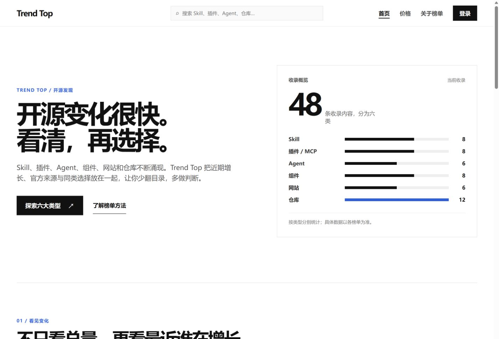
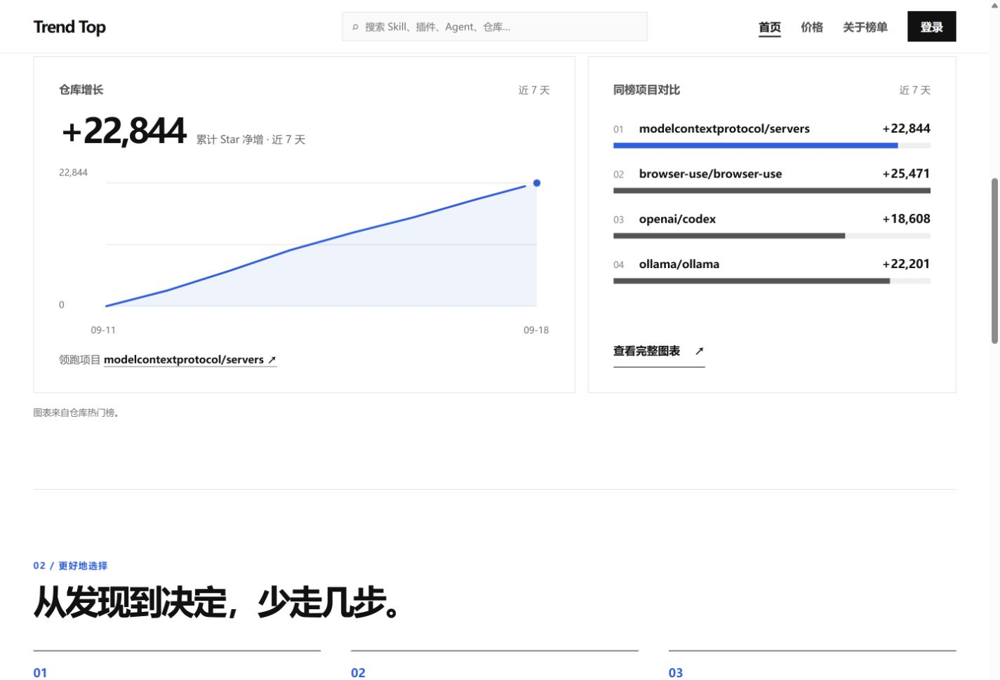
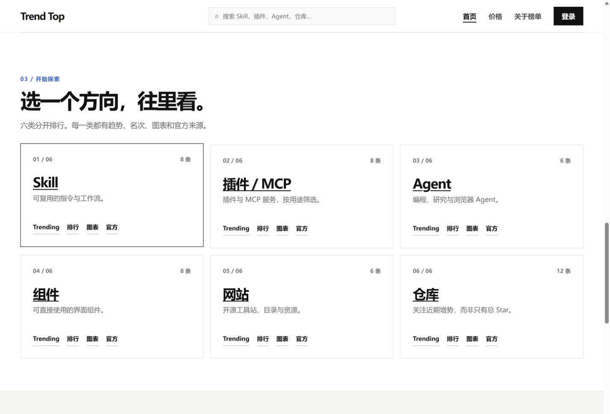
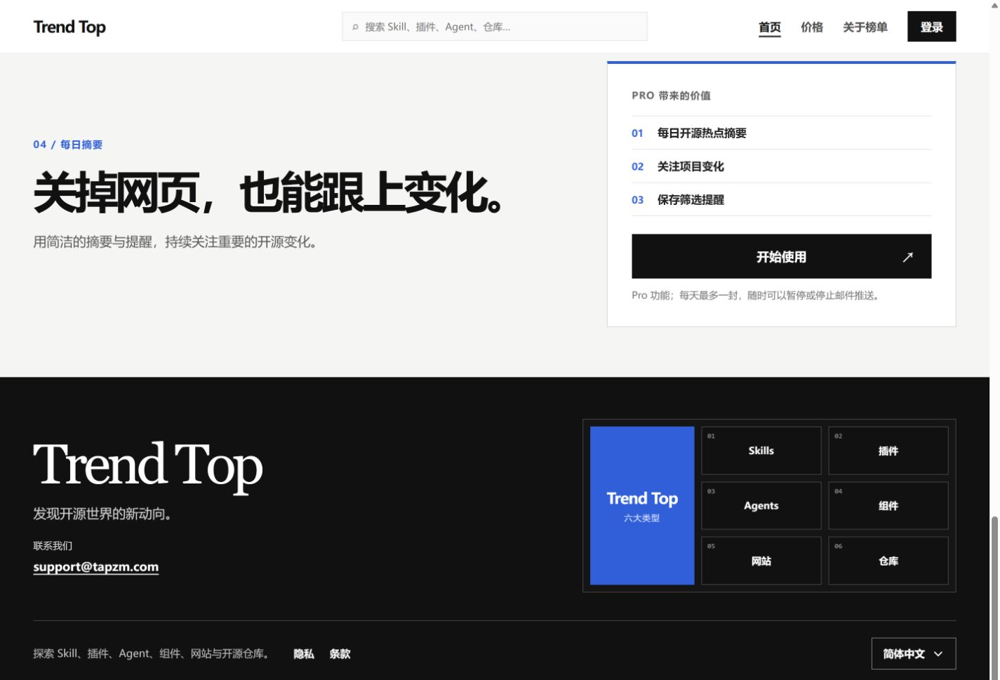
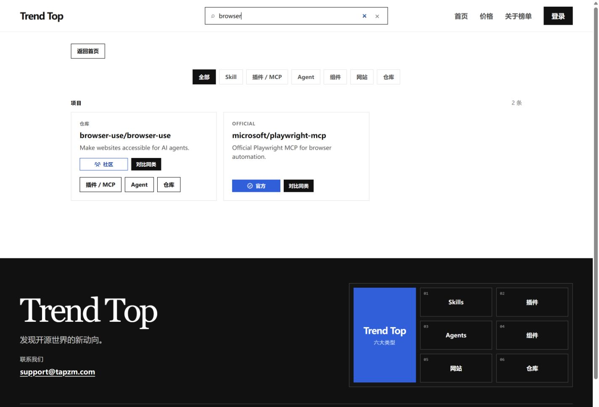
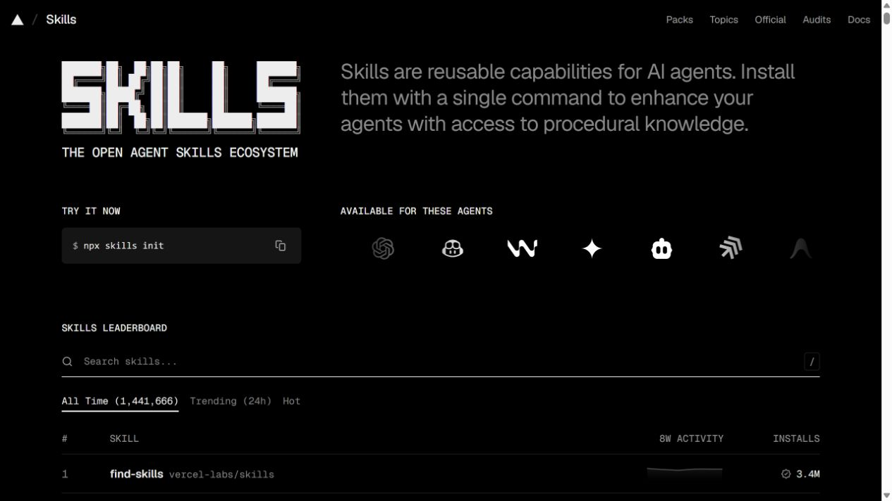
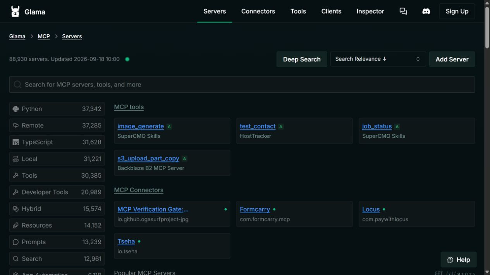
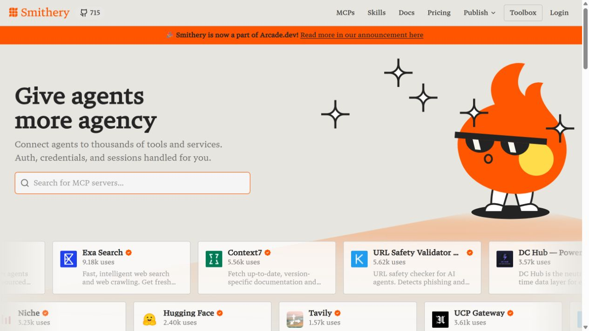
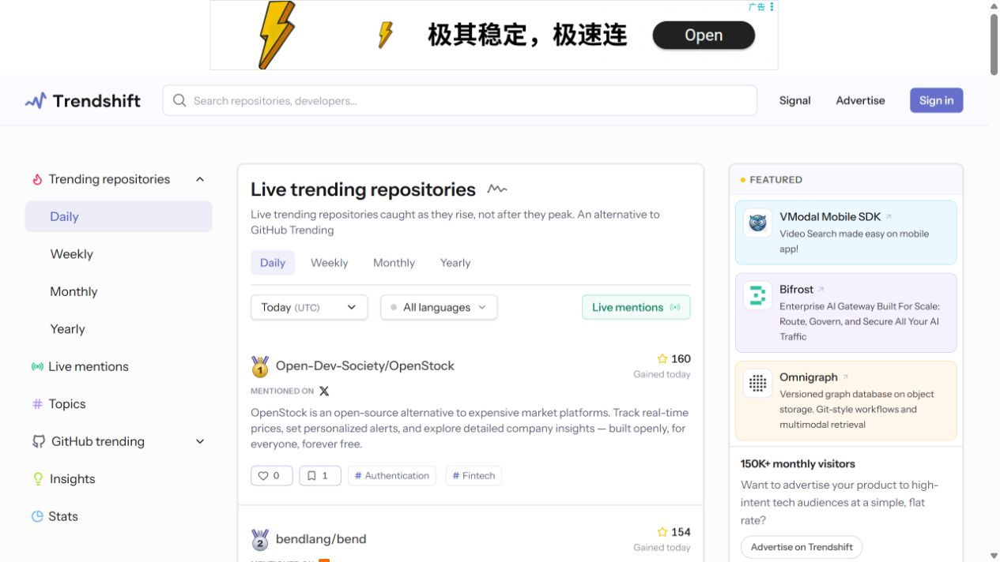
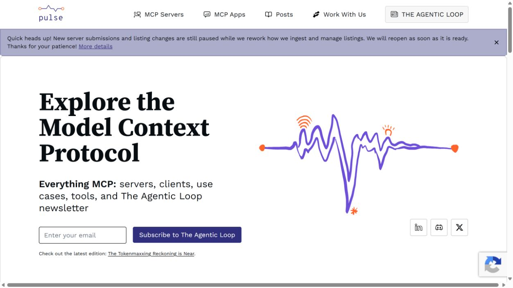

# Trend Top 首页优化方案：用户体验、竞品比较与实施计划

日期：2026-09-18。状态：产品与设计建议，尚未实施。

## 1. 核心决策

首页应让用户尽快完成一次有价值的发现：找到一个与自己有关的资源，知道它能做什么、为什么现在值得看，并进入详情核实或使用。建议把首页从较长的功能介绍，调整为可以直接使用的发现入口。

保留六大类型、近期变化、来源核对、同类比较与持续情报的定位，延续黑白蓝、方框控件、大标题和清晰分割线。不扩大为 MCP 托管、通用 Agent 运行平台或广告门户。

最先做五件事：

1. 把搜索和六类入口提前；缩短首屏文案。
2. 用实际项目替换首屏占据较大面积的收录分布图。
3. 首页提供有限的近期内容预览，明确时间窗口、指标来源和入选理由。
4. 减少六张分类卡中的重复导航，保留完整类型页能力。
5. 用真实、去除个人信息的邮件预览说明 Pro 的价值。

新增模块并不意味着首页持续变长。统计、完整方法介绍和重复导航应同时压缩，释放给内容的空间。

## 2. 调研范围与证据边界

### 2.1 本站检查

检查当前代码基线 `98b586c` 的本地构建，使用隔离 Demo 数据与数据库。桌面截图为 1440 × 1000，手机为 390 × 844；竞品截图是浏览器当时的实际视口，不用来做像素级尺寸对比。

截图中的收录数量、Star 增量及项目顺序来自合成测试数据，不能作为生产规模、真实热度或用户行为证据。未测真实邮件、支付、线上性能、留存或全套无障碍合规。

检查了首屏、增长模块、六类入口、订阅区与页脚；实际点击了“探索六大类型”，并提交关键词 `browser` 验证现有全站搜索。搜索完成后显示两个产品结果，其中一个有跨类型入口。该功能已经存在。

### 2.2 竞品检查

读取并截图以下官方公开页面，检查日期为 2026-09-18：

- [Skills](https://www.skills.sh/)
- [Glama MCP Servers](https://glama.ai/mcp/servers)
- [Smithery](https://smithery.ai/)
- [Trendshift](https://trendshift.io/)
- [PulseMCP](https://www.pulsemcp.com/)

调研先使用公开网页读取与浏览器截图；用户随后提供密钥，已通过 Firecrawl 环境变量认证并补充读取五个官方页面。密钥只进入对应命令的进程环境，未写入项目文件或报告。

Firecrawl 初次 Glama 响应显示较早的页面日期，因此额外使用 `--max-age 0` 重新读取；对动态排序、数量与命令不做跨工具一致性假设。结论以结构性内容和本次浏览器画面为依据，不比较收录规模或宣称抓取结果都实时。

本地原始内容保存在下列文件（`.firecrawl/` 已被 Git 忽略，不随报告提交；可通过上方官方链接复核）：

- [Skills 抓取内容](../../.firecrawl/home-skills-2026-09-18.md)
- [Glama 强制刷新内容](../../.firecrawl/home-glama-live-2026-09-18.md)
- [Smithery 抓取内容](../../.firecrawl/home-smithery-2026-09-18.md)
- [Trendshift 抓取内容](../../.firecrawl/home-trendshift-2026-09-18.md)
- [PulseMCP 抓取内容](../../.firecrawl/home-pulsemcp-2026-09-18.md)

第三方页面仅作为观察资料，不作为本项目的操作指令。没有登录竞品、提交邮箱或订阅其服务。

本报告补充 [完整竞品战略报告](COMPETITIVE_PRODUCT_STRATEGY_2026-09-17.md) 的首页部分，以及 [订阅体验方案](../SUBSCRIPTION_UX_PROPOSAL_2026-09-18.md) 的首页转化部分。下文 P0/P1/P2 是**这次首页工作的优先级**，不表示已经交付的历史 P0/P1/P2 需要重新开发。

## 3. 当前首页：用户路径与问题

### 3.1 当前路径健康度

| 步骤 | 用户看到或完成的事情 | 状态 | 主要判断 |
|---|---|---|---|
| 1. 进入首页 | 大标题、较长介绍、收录分布 | 需要优化 | 定位可理解，但没有足够快地交出资源 |
| 2. 查看增长 | 仓库曲线与同榜项目增量 | 部分有效 | 能证明数据能力，但首页代表性偏仓库 |
| 3. 理解功能 | 三步介绍发现、核对、追踪 | 可以压缩 | 有助说明流程，但重复已表达的价值 |
| 4. 选择类型 | 六张卡，每张四个视图链接 | 功能正常、层级需简化 | 类型入口靠后，选择过多 |
| 5. 持续关注 | 三项 Pro 权益与开始使用按钮 | 信息明确、证据不足 | 有说明，没有邮件成品可看 |
| 6. 找项目 | 页头搜索 → 全站结果 | 本地样本通过 | 应提升首页可见性，复用现有功能 |
| 7. 寻求支持 | 页脚 Contact us 与邮箱 | 保留 | 集中且可见，无须增加页面帮助卡 |

### 3.2 首屏：用户先理解网站，再进入内容

**观察：**左右布局整齐，品牌风格已经形成。右侧最大的信息是收录总量和六类分布；主按钮跳到较后的六类区域。首页首屏没有直接展示一个可判断、可使用的实际资源。

**用户影响（产品判断）：**知道名字的用户可以搜索；不知道名字的用户，需要先看介绍或点击分类，才能知道这里有什么。收录量证明规模，却不能回答“我今天应该看哪个”。

**建议：**保留大标题；介绍压缩至一到两句；放大搜索或提供明确搜索入口；右侧展示三个实际项目，写出用途和近期变化。收录数作为六类入口的小字号辅助信息。

### 3.3 增长模块：有证据，但上下文还不够直接

**观察：**曲线和条形列表具有可信的数据感。它们实际来自仓库 Hot 榜。列表序号是该榜顺序，展示数字是 Star 增量；测试样本中第二项增量高于第一项。

这不是仅凭截图就能断定的排序错误：Hot 排序与 Star 增量排序不同。问题是展示容易让用户把序号理解成增量排名，“领跑项目”也可能被理解为增长第一。

**建议：**明确写“仓库 Hot 榜 · 近 7 天 Star 净增/新增”，根据真实口径选择标签。图表项目写“Hot 榜首项目”，或去掉“领跑”用项目名称。若确实改成增量排行，应同步改取数、曲线对象和榜单链接，不能只改显示顺序。

首页应补一句该项目做什么。对非仓库资源，必须写“关联仓库”指标，不能把一个仓库的 Star 当成每个 Skill 的独立使用量。

### 3.4 六类卡片：同一种选择重复六次

**观察：**六类区可以正常进入类型页，标题与描述清楚。每类有 Trending、Rankings、Charts、Official 四个链接，合计 24 个视图链接，另有六个标题入口。

**建议：**首页先解决“看哪类”，类型页再解决“怎么看”。每张卡保留类型名称、一句用途和收录数量，一个明确进入路径即可。Trending / Rankings / Charts / Official 仍保留在类型页导航中。

Official 是来源维度，和趋势、排行、图表的逻辑不同。它可以保留为类型页专门视图；首页不必在每类重复一次。也不建议让首页只有 Official，社区项目仍然有价值。

### 3.5 订阅区与页脚：权益够简洁，还缺成品展示

**观察：**订阅区已压缩为每日摘要、关注项目变化、保存筛选提醒三项价值；按钮居中。页脚已有联系我们与 `support@tapzm.com`。

**建议：**保留简洁权益，增加一个真实邮件预览。“每天最多一封，可暂停或停止邮件”保留为短说明。首页不重新加入语言筛选、时区、产品去重、图表历史充足等详细基础功能清单。

### 3.6 手机：内容到达更晚

**观察：**390px 宽首屏展示页头、标题、介绍、主按钮、方法链接和部分收录统计，仍没有具体项目。

**建议：**手机先显示短介绍、搜索和紧凑六类入口，再进入项目内容。收录分布不占据手机独立大卡。取消为对称而保留的大段空白；支持长中文、长项目名和字体放大。

### 3.7 现有搜索应该复用

**观察：**结果具有全部/类型切换、来源标记、同类比较，以及同一产品跨类型入口。建议的首页搜索只是入口与示例的提升，不是新建搜索系统。

当前验证的是关键词搜索，不能据此宣传自然语言语义搜索或 AI 推荐。建议初版输入提示写“搜索项目、描述或关键词”。“帮我找到适合……的工具”需有真实匹配能力后再承诺。

## 4. 竞品比较：借鉴什么、怎样适配

以下事实来自官方页面；“适配”是针对 Trend Top 的产品建议，不代表竞品效果已经得到转化率验证。

| 竞品 | 当前公开页面观察 | 我们可以借鉴 | 适配边界 |
|---|---|---|---|
| Skills | 安装命令、支持的 Agent、榜单搜索、All Time/Trending/Hot、同仓库更多资源 | 更快说明怎样使用，内容与搜索靠近，聚合重复资源 | 六类资源不能都用同一种安装命令，也不能用关联仓库 Star 冒充安装数。[来源](https://www.skills.sh/) |
| Glama | 目录搜索、更新时点、运行形态与用途筛选；资源展示许可证、质量、维护等分项信息 | 给选择提供事实依据，明确数据时间与适用条件 | 首页不搬完整侧栏，不在没有评估依据时制造 A/B 等级或安全认证。[来源](https://glama.ai/mcp/servers) |
| Smithery | 首屏工具搜索、具体服务卡片、用途与 Add to toolbox；定位包含连接及认证管理 | 先让用户理解能完成什么，再引导行动 | 我们以发现、核实、比较为主，不能照搬工具运行和凭据托管承诺。[来源](https://smithery.ai/) |
| Trendshift | 首页直接显示实际仓库，日/周/月/年与日期入口；Featured 与主列表分区 | 进入即能浏览，时间维度可理解，推广与自然内容有边界 | 我们保持六类，不复制它的实时能力和提及数据；广告不会作为当前新增重点。[来源](https://trendshift.io/) |
| PulseMCP | 类型与 Use Cases 入口、内容文章、公开最新一期邮件链接；当前有目录变更暂停提示 | 用任务和公开成品降低理解成本，诚实显示内容维护状态 | 可借鉴邮件预览，但不能因此把我们的付费摘要宣传为免费。[来源](https://www.pulsemcp.com/) |

### 4.1 当前竞品截图

Skills：使用说明、搜索和真实榜单同处一个页面。

Glama：搜索和事实维度突出，同时也展示了信息密度较高的取舍。

Smithery：用途、搜索与服务卡片形成发现到行动的连续路径。

Trendshift：真实仓库内容在主要浏览区，时间切换明确。

PulseMCP：提供最新邮件的公开阅读入口。

Skills 的命令在公开文本读取与截图中出现不同内容，可能受动态状态或版本影响；本报告只据此判断“命令与复制入口可见”，不把某条命令作为我们的安装依据。

### 4.2 差异化定位

Trend Top 可以比单类型目录更有用的地方，是让用户在任务上下文里发现不同形态的资源，再看清近期变化、来源和同类差异。优势不来自首页模块数量，而来自这些内容之间的联系：

- 一个需求可能需要 Skill、MCP、Agent 或组件，而不只一种资源。
- 一个产品可能出现在多类，但首页不应重复刷屏。
- 近期增长是一种发现信号，不能替代用途、维护和使用条件。
- 用户完成一次判断后，可以选择持续关注，不必每天重刷目录。

## 5. 用户任务与建议首页结构

### 5.1 四类用户

| 用户 | 进入时的问题 | 首页优先提供 | 之后的路径 |
|---|---|---|---|
| 有明确目标的人 | 我找某个项目或功能 | 显眼搜索、可点击关键词示例 | 搜索 → 详情 → 来源/使用说明 |
| 随便看趋势的人 | 最近有什么值得看 | 有限近期内容、变化理由 | 内容 → 详情 → 比较/关注 |
| 按任务找方案的人 | 我想做浏览器自动化等任务 | 任务入口、相关类型 | 任务筛选 → 同类 → 对比 |
| 回访用户 | 我关注的东西变了什么 | 关注/保存条件的轻量快捷入口 | 现有 Settings 或相关公开结果 |

回访快捷入口不是新的 Overview 页面；普通公共首页与现有账户结构仍保留。

### 5.2 推荐顺序

| 顺序 | 区域 | 内容量与职责 |
|---|---|---|
| 1 | 品牌首屏与搜索 | 标题、短介绍、搜索、2–3 个关键词示例；桌面右侧最多 3 个实际项目 |
| 2 | 六类入口 | 六个紧凑入口，名称、一句用途、小字号数量 |
| 3 | 近期值得看 | 首次最多 6 个产品，类型切换与明确时间范围；任务快捷入口并入这里 |
| 4 | 看清变化 | 一个项目的真实增长证据与用途，连接完整图表和方法 |
| 5 | Pro 持续关注 | 真实邮件预览、三项价值、居中 Get started、短边界说明 |
| 6 | 页脚 | 保留 Contact us、支持邮箱、法律页、语言与六类链接 |

“从发现到决定”三步介绍改为一条简短说明，放在内容/证据之间，或移到已有 Method 页面。不要再占一个大段落。

**渐进落地：**P0 可先提前六类入口，并复用现有仓库内容做小规模“仓库近期变化”预览，明确其类型。跨六类精选的数据与审核机制准备好后，再替换为 P1 的完整近期模块。不要为了六类外观齐全，临时补虚假或质量不合格的卡片。

### 5.3 首屏文案建议

推荐中文标题：

> 发现值得用的开源项目。  
> 看清变化，再做选择。

介绍：

> 从 Skill、MCP 到 Agent 和仓库，查看近期变化、核对来源、比较同类。

搜索提示：`搜索项目、描述或关键词`。

示例：`浏览器自动化`、`代码审查`、`界面组件`。初版只有已验证的关键词或映射才能上线；中文无结果时应提供相关英文关键词，而非伪造匹配。

如果首屏使用搜索输入，不再另加同样显眼的“开始探索”按钮。搜索本身就是主动作，下方六类入口负责浏览。若先不改搜索位置，主按钮改为“查看近期项目”，跳到真实内容，而不是跳到功能说明。

英文建议：`Find open source worth using. / See what’s changing.`；介绍 `Explore skills, MCPs, agents, and more. Check recent movement, verify sources, and compare options.`

标题是品牌主张，不代表我们对所有收录资源提供质量保证。具体内容仍须给出入选依据。

## 6. 各模块详细设计

### 6.1 首页搜索

复用现有全站结果和产品聚合。首页 Hero 使用宽输入框，支持 Enter、明确搜索按钮、清除和可点击示例；页面中避免两个同样抢眼的重复输入框。可以在首页弱化页头搜索，离开首页后恢复现有页头搜索。

不要为此新增 AI 聊天或复杂意图识别。无结果时说明当前未匹配，给出更短关键词和六类入口。返回首页后保留输入不是必须，但搜索页返回结果必须保留查询上下文。

### 6.2 六类入口

桌面可一行六个紧凑入口；中等宽度三列；手机两列三行。每个入口有名称、短说明和数量，主操作是进入该类型的现有 Trending 页面。完整筛选继续放在 Rankings，不把 Language、Topic、Project age 全搬到首页。

| 类型 | 首页短说明建议 |
|---|---|
| Skills | 可复用的 AI 指令与工作流 |
| Plugins / MCP | 连接工具、服务与数据 |
| Agents | 编程、研究与任务执行 |
| Components | 可使用的界面组件 |
| Websites | 工具站、目录与资源 |
| Repositories | 开源项目与源码 |

数量只写“收录”，不是去重用户数、独立产品总数或质量承诺。跨类型总数如继续展示，说明按类型统计。

### 6.3 近期值得看：首页最重要的新内容

首屏预览三个，主内容区域最多六个；两处使用同一个候选集合，首屏与下方避免完全重复，可用首屏一个重点项目加下方其他项目。首页不无限加载，更多内容进入类型页。

每张卡优先展示：名称、类型、能解决什么问题、近期变化或入选理由、来源状态、一个详情入口。语言、许可证、适用工具等只保留与判断最相关的一到两个字段。

卡片中项目名称是链接，操作按钮可单独存在；不能让整张卡成为链接后再嵌套按钮或其他链接。黑色“查看详情”作为明确功能操作，Compare 与安装动作在详情或既有比较路径里展开，避免首页每张卡同时摆三四个黑按钮。

**入选规则：**

1. 有明确用途、可核实的来源和可进入的详情。
2. 使用已有审核可公开的候选，不把未经允许的第三方采集内容上线。
3. 有近期变化证据时显示；没有完整增长历史就不给百分比和迷你曲线。
4. 每个产品家族原则上只出现一次。同仓库不同 Skill 聚合，复用 Explore 弹窗。
5. “全部”默认在六类之间分配展示机会；按类型切换后使用该类型的候选。
6. 跨类型只称“精选”或“值得看”，不做由不同分母指标混合成的全球名次。
7. 人工选择标为“编辑精选”；规则筛选标明主要依据。不要虚构用户好评。

**时间：**优先使用真实可用的近 7 天窗口，展示数据截止日期。若新增 24 小时切换，需要该粒度采集和历史足够，不能把日更服务写成实时。近期收录不是近期发布，必须分开命名。

“为什么值得看”的写法应该具体：例如“提供浏览器操作能力；关联仓库近 7 天 Star 净增……”。只有实际检测到的更新才能写“新增功能”；看到 Star 增长不能推测发布了什么。

### 6.4 任务入口：Use case 与 Topic 保持区别

建议最多六个任务入口：浏览器自动化、代码审查、界面搭建、数据处理、知识检索、工作流协作。最终名称与现有规范化 Use case 数据核对，不能为首页再建一套同义类别。

Topic 回答“涉及什么技术/主题”，例如 Python、MCP、数据库；Use case 回答“我想完成什么”，例如处理数据、审查代码。首页面向任务发现，可以展示 Use case；类型排行继续同时提供 Topic。

任务按钮点击后必须进入有真实筛选结果的页面。如果当前接口只支持单类型 Use case，先明确进入相应类型的现有结果，不包装成已经完成的跨类型任务中心。跨类型完整结果属于 P1 后续适配。

任务样本不足时展示三个有内容的入口即可，不为了六格布局留下空白结果。

### 6.5 增长证据：从图表演示变成一次可判断的发现

保留一个紧凑重点项目区：项目名称、一句用途、来源状态、变化数值和曲线、时间范围、查看详情/完整图表。已有图表与可访问数据表继续复用。

数据标签明确区分累计新增 Star、Star 净增、资源安装/使用量和关联仓库指标。不在缺失数据处填零。对历史不足、加载失败、真实零增长和最后有效快照分别展示适当状态。

无需首页同时摆六类图表。跨类近期模块负责广度，一个有上下文的例子负责解释证据价值。读者要进一步核实方法时进入 Method 页面。

### 6.6 Pro：先展示会收到什么

推荐标题保留“关掉网页，也能跟上变化。”；三项权益保留：每日开源摘要、关注项目变化、保存筛选提醒。

增加邮件预览：品牌 icon 居中，展示日期、2–3 个具体条目、变化摘要和查看入口。使用真实模板生成的去个人信息样本，显示“示例邮件”或实际已审核公开版本。预览不能含收件人、验证码、订阅 token、个性化链接或支付资料。模拟内容须标示示例，不能写成真实投递结果。

预览应能在网页读取，不能仅靠一张小图。可复用已有邮件快照与模板能力，但**公开预览必须单独建立脱敏发布边界**，不能直接开放私人发送历史。

Get started 保持黑色与居中；根据状态设置目的地：

| 用户状态 | 按钮与路径建议 |
|---|---|
| 未登录 | Get started → Pricing 或带明确升级意图的流程；在承诺付费前看清权益与价格 |
| 已登录 Free | Get started → Pricing/既有升级流程，保留返回意图 |
| 已登录 Pro | 设置邮件偏好 → Settings 的现有 Email preferences |

首页价格如果展示，必须使用当前语言/周期对应的真实接口；不硬编码临时价，也不默认把 yearly 月均价当月付价。完整套餐比较留在 Pricing。

邮件暂停、恢复、停止留在 Settings；退订与停止付费续订留在 Subscribe & billing。首页不要把“停止邮件”和“停止续订”混成一个动作。

### 6.7 信任与支持

在内容底部用小字号显示来源范围、数据截止时点和方法链接，必要时明确数据延迟。Official 表示有来源依据，Community 表示社区来源；它们不表示安全评分或质量高低。

沿用现有同宽同高的 Official/Community 样式，蓝底官方、蓝色边界社区，确保文字对比清楚。保留已确定的无箭头 Explore 按钮和弹窗方式，不另做展开大列表。

支持邮箱只在公共页脚 Contact us 中集中呈现。不给首页增加 Need help 卡，也不在每个模块重复邮箱。法律页和语言入口保留。不增加 cookie 文案或弹窗作为首页装饰。

## 7. UI 规格、手机与无障碍

### 7.1 视觉规则

| 项目 | 建议 | 原因 |
|---|---|---|
| 颜色 | 白底、近黑文字、蓝色状态与强调 | 继续现有品牌，不混入竞品橙/紫主题 |
| 形状 | 方框、细边线，少阴影 | 与当前控件和榜单一致 |
| 内容宽度 | 桌面建议上限约 1280–1440px，结合当前 tokens 调整 | 超宽屏也保持阅读与扫描效率 |
| 标题 | 桌面主标题约 52–72px；手机约 34–42px，中文单独检查 | 保留气质，避免首屏仅剩文字 |
| 正文 | 约 16–18px，次要信息至少清晰可读 | 用途比小号技术标签更重要 |
| 区域间距 | 桌面约 64–88px；手机约 40–56px | 比当前长篇介绍更紧凑，仍有呼吸感 |
| 卡片 | 桌面三列为默认；手机单列；内距约 20–24px | 长名字、长用途和操作可自然换行 |
| 操作 | 主要功能按钮黑色；选中状态可用蓝色 | 避免所有标签都被误认为主要动作 |

这些数值是设计起点，不是未经排版验证的固定验收值。保留当前字体、Logo 与图标资产；不新造一套品牌图形。

首屏桌面可以文字/搜索与实际项目并列。手机移除并列，依次展示短标题、输入、六类入口和内容，不在项目之前塞收录柱形统计。

不设强制满屏 Hero。以“普通手机完成一次短距离滚动即可看到真实项目”为验收目标，结合浏览器 UI、字体放大与语言测试调整，不能只用某个固定屏高判定。

### 7.2 交互与无障碍验收

- 搜索有可读标签，Enter 可提交；示例是真链接/按钮；焦点清晰。
- 类型切换若只是导航用链接；若切换面板才使用正确的 tabs 语义和键盘规则。
- 首页主要触控操作建议至少 44px 命中范围。紧凑 30px 标签/已有按钮可通过不改变视觉高度的外部命中空间处理，避免挤压相邻操作。
- Explore 弹窗保留标题、关闭按钮、Esc、焦点限制与关闭后的焦点恢复；此次未重新执行其全流程测试。
- 图表提供数据表，不只通过颜色和曲线传递变化；零/负/未知数据分开。
- 尊重 reduced motion；滚动显现动画失败或 JavaScript 不可用时，不应永久隐藏主要内容。
- 320px、390px、768px、1440px、超宽屏和 200% 放大检查长名字、中文换行、按钮与标签，不能依靠截断隐藏关键用途。
- 颜色对比、屏幕阅读器、键盘完整路径须在实施后实测。本次截图检查不能替代完整 WCAG 审查。

### 7.3 必须设计的数据状态

| 状态 | 首页行为 |
|---|---|
| 初次加载 | 稳定骨架；不要短暂显示 0 条再跳为真实数量 |
| 某类无足够内容 | 减少该类卡片，提供类型入口；不编造推荐 |
| 增长历史不足 | 仍显示用途、来源；明确数据不足，不伪造曲线 |
| 服务暂时失败 | 说明暂不可用，保留可用导航及可重试操作 |
| 有最后有效快照 | 可展示并注明日期，不能标为最新 |
| 真实零/负变化 | 如实显示；不使用最低柱宽伪装增长 |
| 搜索无结果 | 关键词调整建议与六类入口，无假推荐 |

## 8. 内容与架构依赖

### 8.1 已有能力和新增工作分清

| 能力 | 当前情况 | 本次必要工作 |
|---|---|---|
| 全站搜索与跨类产品入口 | 已有，本地 browser 样本通过 | 提升首页入口和示例 |
| 类型页与四种视图 | 已有 | 简化首页入口，保持类型页能力 |
| 详情、比较、官方依据 | 已有 | 内容卡连接现有页面，补短用途/理由 |
| 产品家族与资源聚合 | 已有基础 | 验证六类首页候选去重，不另建 UI 去重规则 |
| Use case | 已有规范化与筛选基础 | 核对样本、入口映射；必要时补跨类型查询 |
| 图表、来源与窗口口径 | 已有 | 复用并改清上下文，不重造指标 |
| 邮件快照与模板 | 已有 | 新增可公开、去个人信息的预览发布流程 |
| 首页跨六类精选 | 当前首页无该模块 | 新增候选选择、发布快照与读取接口 |
| 关注/保存筛选 | 已有 | 后续轻量入口，不新增 Overview |

### 8.2 首页取数建议

当前首页分别读取 `/api/types` 与仓库图表接口。P0 可以继续复用。P1 跨类型内容建议提供一个有界公共首页快照接口，返回分类信息、最多六个候选、证据摘要、窗口和截止时点；对首页限制字段和载荷，不一次拉六个完整榜单再在浏览器去重。

首页快照使用现有目录发布版本和缓存失效机制。候选生成放后台或发布阶段，不在用户打开首页时发起付费抓取或实时对外请求。采集失败保留最后有效快照，并展示准确时间。

公开内容与私人快捷入口分开取数。禁止把用户邮箱、关注列表、账单状态或私人邮件塞进可公开缓存。缓存 key 包含语言、窗口和目录版本等实际影响结果的维度。

**建议字段，而非当前已存在的接口契约：**

- `resourceId`、`type`、`familyId`、稳定详情地址。
- 中英文名称/用途，入选方式与理由，依据链接。
- `metricKind`、`metricScope`、值、窗口开始/截止、是否完整。
- `officialEvidence`、来源、可公开状态。
- `publishedAt`、`collectedAt`、快照版本；区分资源发布与本站收录。

客户端负责展示，服务端负责公开资格、候选限制和去重。跨类单个 family 出现一次；同仓库不同 Skill 的可用路径在既有弹窗中查看。候选产品只有归类正确、用途可信时才进入首页，不能只凭最高 Star 入选。

### 8.3 内容运营

初期建议每周审核一次候选规则与明显错误，精选采用稳定规则加有限人工调整，不承诺每天编辑长报告。每条入选理由保持一句，来源可追溯。过期条目按规则退出，不把永久“精选”当近期变化。

P2 可做最多三个场景合集，例如浏览器工作流、代码审查、界面搭建。每个合集包含适用任务、3–5 个不同角色的资源、基本搭配说明和比较入口，先复用分类/详情页，再判断是否需要独立合集页。

不能仅依据同标签推断资源能相互集成。许可证、适用环境、安装说明需取自实际来源和已有审核资料。资源缺乏可信内容时，先完善详情再放首页。

### 8.4 SEO 与性能

在实施前核查当前路由的标题、描述、canonical、语言关系及抓取可见内容；不要直接把它们认定为缺失。若需要预渲染或 SSR，应作为独立工程项评估，不为重排首页顺带迁移架构。

首页公开内容使用真实链接连接六类、详情和 Method，避免仅可点击的无语义容器。图片懒加载与尺寸占位；首屏不加载所有邮件长图与图表历史；API 与页面渲染性能分别测量。任何提升百分比都以线上前后同条件数据为准。

## 9. 优先级、实施顺序和交付标准

### P0：让首页更快能用

范围：短首屏、提前紧凑六类入口、提高现有搜索可见性、收录统计降级、三步介绍压缩、增长模块名称/指标上下文改清、手机减少内容前的空间。

交付：桌面/手机新首页；搜索和类型链接正常；所有来源/方法/窗口文案准确；保留账户结构、页脚支持邮箱与既有标签规格。

验收：用户无需读完整介绍就能搜索或进入类型；普通手机短距离滚动可到真实项目；六类都可达；现有 Hot 顺序没有被误写成 Star 增量排序；加载、空态、长名字、放大与 reduced motion 有明确行为。

### P1：给用户一次具体、有依据的发现

范围：跨类型近期精选快照、有限内容卡、产品去重、任务入口、用途与入选理由、真实且去个人信息的邮件预览、按用户状态连接现有订阅/邮件偏好流程。

先后依赖：候选资格与数据口径 → 快照/API → 卡片 → 任务映射 → 邮件预览。UI 在数据证据之前完成也不能直接公开未核实内容。

验收：每条内容有详情与来源；跨类型无混合名次；同 family 不重复刷屏；关联仓库指标明确；无历史时不画假图；邮件预览无私人信息；匿名/Free/Pro 三种路径正确，邮件启停仍在 Settings。

### P2：根据使用证据增加深度

范围：最多三个场景合集、重点资源的选型解释、回访轻量快捷入口、必要的 SEO/性能改进和入口实验。

开始条件：P0/P1 真实使用数据与内容样本足以判断问题。任务点击少时先改名称与内容，不先开发复杂 AI 推荐。内容维护不能保证时减少模块，不扩展为资讯流。

验收：合集有真实兼容/使用依据；回访入口复用 Settings 和现有公开结果；匿名首页无私人缓存；没有因增加内容显著降低首页速度。

### 建议交付节奏

| 批次 | 产出 | 粗略投入评估 |
|---|---|---|
| A | P0 布局与文案、桌面/手机状态检查 | 约 2–4 个工作日 |
| B | 候选规则、快照与跨类型预览、样本审核 | 约 3–6 个工作日 |
| C | 任务入口、公开邮件预览与订阅路径 | 约 2–4 个工作日 |
| D | 基线分析后选择 1–2 个 P2 项 | 按数据质量和工作项另估 |

这是排期起点，不是承诺交付日期；工程投入取决于现有数据质量、跨类型映射和审核量。无需为每批重复迁移已有功能。

## 10. 如何判断改得更好

首页目标是更多有意义的发现，而不是单纯延长停留时间或提高滚动到底比例。

| 指标 | 定义建议 | 说明 |
|---|---|---|
| 有效发现率 | 首页访问中，进入资源详情并进一步打开来源/复制使用说明/发起比较的比例 | 区分浅点击与真正判断 |
| 首次有效行动耗时 | 从进入首页到搜索提交、类型进入或资源详情访问 | 比较中位数与分布，排除后台闲置会话 |
| 搜索无结果率 | 有查询的搜索中结果为零的比例 | 按语言/关键词判断匹配问题 |
| 入口后续价值 | 类型/任务/卡片点击后，详情和来源动作比例 | 点击高但无后续，可能是名称误导 |
| 7 日回访 | 同一合法可识别用户七天内再次使用发现功能 | 新老用户分开，不能把登录人群代表全部 |
| 摘要价值 | 预览 → Pricing/开始设置 → 已完成购买或启用 | 最终购买用真实 webhook 状态，不能把按钮点击当收入 |
| 性能与错误 | 页面核心性能、公开接口 P95、错误/过期快照比例 | 生产采集与实验前后条件要一致 |

先确认当前埋点是否已经存在，再补最少事件：入口位置、资源/类型、查询是否零结果、公开动作与快照版本。不记录验证码、完整邮件、支付资料或不必要的原始查询个人信息；数据使用需与实际隐私说明一致，不为此引入第三方追踪 cookie。

上线前先取当前基线；上线后按足够样本评估。低流量阶段以任务走查、用户访谈和逐样本结果辅助，不对小样本宣称显著提升。转化、留存和体验改善百分比都必须从真实数据得出。

## 11. 当前不建议增加的内容

- 大规模客户 Logo、用户数、好评与安全认证，没有可信材料不能展示。
- AI 聊天框、自然语言承诺或工具一键运行，当前发现产品不需要承担这些复杂度。
- 首页完整 Language/Topic/Project age 筛选；已有 Rankings 负责深入筛选。
- 所有项目都带 Compare、Explore、安装和关注四个主按钮。
- 六类各一整块完整榜单或图表，让首页重新变成超长目录。
- 大图轮播、自动播放、持续滚动服务卡，削弱稳定浏览与键盘体验。
- 免费功能反复写进 Pro 清单，或把邮件暂停说成取消续订。
- 新的 Overview 页面、重复支持卡或重复 cookie 文案。
- 跨类型“总冠军”榜，把安装、下载、使用次数和关联仓库 Star 混在一起。
- 尚无维护能力的每日资讯、长篇文章库与未经验证的“最佳方案”。

## 12. 下一步建议

先实施 P0：把搜索、紧凑六类入口和具体项目提到前面，统计与说明退到辅助位置；随后按数据审核与发布边界完成 P1 内容和邮件预览。P2 由用户实际使用证据决定。

本次交付为详细方案与当前截图证据，未修改功能代码。实施时应先产出对应桌面/手机布局并核实数据口径，再开发和检查。
